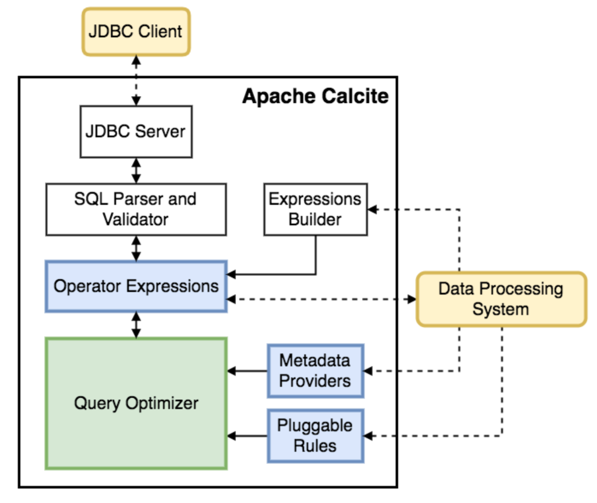
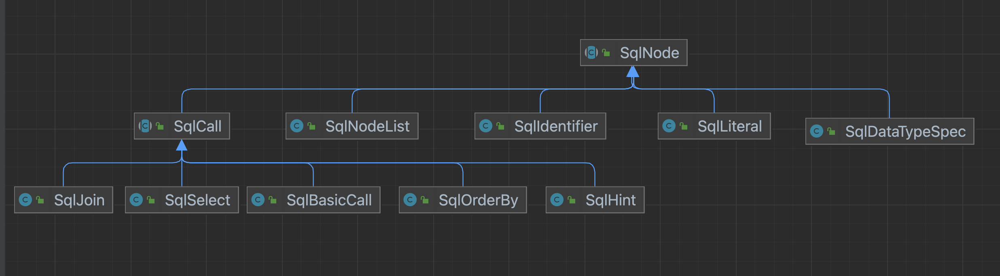
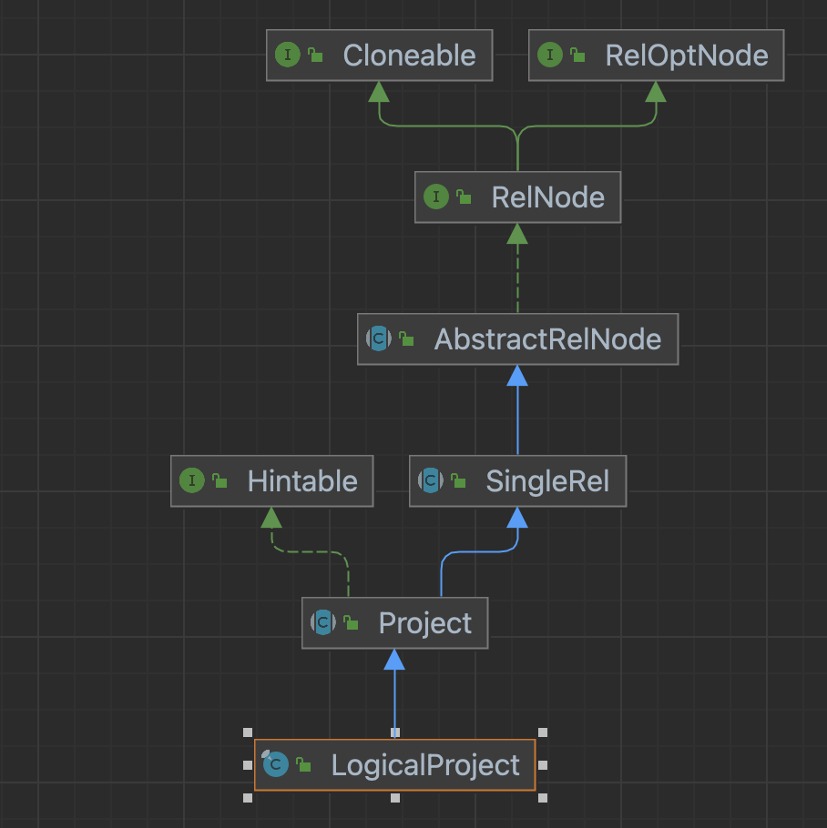

# Calcite 简介


## 简介
Apache Calcite是一个动态数据管理框架。  
它包含构成典型数据库管理系统的许多部分，但省略了一些关键功能:数据存储、处理数据的算法和存储元数据的存储库。  
我们主要用 Calcite 来解析SQL。很多项目也是直接使用了Calcite来解析SQL，优化SQL等，比如 FlinkSQL

calicte的基本架构如下


## 关系代数

关系模型源于数学。关系是由元组构成的集合，可以通过关系的运算来表达查询要求，而关系代数恰恰是关系操作语言的一种传统的表示方式，它是一种抽象的查询语言。  
关系代数的运算对象是关系，运算结果也是关系。与一般的运算一样，运算对象、运算符和运算结果是关系代数的三大要素。  
关系代数的运算可分为两大类：  
- 传统的集合运算。这类运算完全把关系看成元组的集合。传统的集合运算包括集合的广义笛卡儿积运算、并运算、交运算和差运算。
- 专门的关系运算。这类运算除了把关系看成元组的集合外，还通过运算表达了查询的要求。专门的关系运算包括选择、投影、连接和除运算。
关系代数中的运算符可以分为四类：传统的集合运算符、专门的关系运算符、比较运算符和逻辑运算符。

关系运算 和 SQL的关系如下
| 运算符        | SQL关键字       | 含义         | 分类     |
| ------------- | --------------- | ------------ | -------- |
| $$\cap$$      |                 | 交           | 集合运算 |
| $$\cup$$      |                 | 并           | 集合运算 |
| $$-$$         |                 | 差           | 集合运算 |
| $$\times$$    | from A,B        | 广义笛卡尔积 | 集合运算 |
| $$\sigma$$    | where           | 选择         | 关系运算 |
| $$\Pi$$       | select distinct | 投影         | 关系运算 |
| $$\bowtie$$   | join            | 连接         | 关系运算 |
| $$\div$$      |                 | 除           | 关系运算 |
| $$>$$         |                 | 大于         | 比较运算 |
| $$<$$         |                 | 小于         | 比较运算 |
| $$=$$         |                 | 等于         | 比较运算 |
| $$\neq$$      |                 | 不等         | 比较运算 |
| $$\leqslant$$ |                 | 小于等于     | 比较运算 |
| $$\geqslant$$ |                 | 大于等于     | 比较运算 |
| $$\neg$$      |                 | 非           | 逻辑运算 |
| $$\land$$     |                 | 与           | 逻辑运算 |
| $$\lor$$      |                 | 或           | 逻辑运算 |

SQL语句会先翻译成为关系代数后再被执行的
在执行explain 一条SQL的时候 就可以看到翻译后关系代数的命名

```txt
== Abstract Syntax Tree ==
LogicalProject(user=[$0], product=[$1], amount=[$2])
+- LogicalFilter(condition=[>($2, 2)])
   +- LogicalTableScan(table=[[*anonymous_datastream_source$1*]])
```

## Calcite 解析流程
1. Parser 将SQL语句(字符串) 解析成 AST(抽象语法树) 语法树的节点在代码中为SqlNode
2. Validate 校验SqlNode节点，替换节点中的部分属性，设置单调性等信息
3. Convert 将SqlNode 抽象语法树 转换成RelNode，执行逻辑执行计划
4. Optimize 成本优化
5. Execute 生成动态代码，并执行物理执行计划

其中，
- SqlNode 是语法树上的节点，其本质是把SQL语句进行拆解
- RelNode 是关系节点，代表的事关系代数中的关系操作，RelNode 更倾向数学的概念，就可以进行下一步的优化了
- RexNode 虽然RexNode也属于关系节点，但是这里的RexNode更偏向于去表示表达式，比如一个常数，或者是 简单的a+b的运算，亦或是count(*) 这样的聚合；所以一个RelNode中会有很多RexNode节点

### SqlNode

SqlNode 是一个抽象类，没有过多的信息，就包括一个位置信息的对象SqlParserPos  
SqlParserPos 是用来表示SQL语句中的位置信息的类。它包含了行号、列号和字符偏移量等信息，可以用于定位SQL语句中的错误或者生成更加详细的错误信息  

```java
public abstract class SqlNode implements Cloneable {
  //~ Static fields/initializers ---------------------------------------------

  public static final @Nullable SqlNode[] EMPTY_ARRAY = new SqlNode[0];

  //~ Instance fields --------------------------------------------------------

  protected final SqlParserPos pos;
}

public class SqlParserPos implements Serializable {
  //~ Static fields/initializers ---------------------------------------------

  /**
   * SqlParserPos representing line one, character one. Use this if the node
   * doesn't correspond to a position in piece of SQL text.
   */
  public static final SqlParserPos ZERO = new SqlParserPos(0, 0);

  /** Same as {@link #ZERO} but always quoted. **/
  public static final SqlParserPos QUOTED_ZERO = new QuotedParserPos(0, 0, 0, 0);

  private static final long serialVersionUID = 1L;

  //~ Instance fields --------------------------------------------------------

  private final int lineNumber;
  private final int columnNumber;
  private final int endLineNumber;
  private final int endColumnNumber;
}
```
从SqlSelect的这个类中就可以看出，一个简单的SQL语句在SqlSelect中都能找到
```java
public class SqlSelect extends SqlCall {
  //~ Static fields/initializers ---------------------------------------------

  // constants representing operand positions
  public static final int FROM_OPERAND = 2;
  public static final int WHERE_OPERAND = 3;
  public static final int HAVING_OPERAND = 5;

  SqlNodeList keywordList;
  SqlNodeList selectList;
  @Nullable SqlNode from;
  @Nullable SqlNode where;
  @Nullable SqlNodeList groupBy;
  @Nullable SqlNode having;
  SqlNodeList windowDecls;
  @Nullable SqlNodeList orderBy;
  @Nullable SqlNode offset;
  @Nullable SqlNode fetch;
  @Nullable SqlNodeList hints;
}
```
这里的keywordList是保留字，如果有 distinct 这种就会放在这个keywordList中
不过从debug的过程来看 这个keywordList是个空的数据



### RelNode

RelNode 是个接口 继承了 RelOptNode  
RelOptNode 目前没有看到除了RelNode以外有其他地方使用和实现

RelNode 接口定义了树结构的父类以及节点数据和类型的方法 真正处理的方法都放在了 RelShuttle 和 RexShuttle中
```java
public interface RelNode extends RelOptNode, Cloneable {

  /**
   * Accepts a visit from a shuttle.
   *
   * @param shuttle Shuttle
   * @return A copy of this node incorporating changes made by the shuttle to
   * this node's children
   */
  RelNode accept(RelShuttle shuttle);

  /**
   * Accepts a visit from a shuttle. If the shuttle updates expression, then
   * a copy of the relation should be created. This new relation might have
   * a different row-type.
   *
   * @param shuttle Shuttle
   * @return A copy of this node incorporating changes made by the shuttle to
   * this node's children
   */
  RelNode accept(RexShuttle shuttle);
}
```

可以具体一点，看一下比较常用的RelNode 的实现是如何定义的：LogicalProject


```java
/**
 * Sub-class of Project not targeted at any particular engine or calling convention.
 */
public final class LogicalProject extends Project {
  //~ Constructors -----------------------------------------------------------

  /**
   * Creates a LogicalProject.
   *
   * <p>Use {@link #create} unless you know what you're doing.
   *
   * @param cluster  Cluster this relational expression belongs to
   * @param traitSet Traits of this relational expression
   * @param hints    Hints of this relational expression
   * @param input    Input relational expression
   * @param projects List of expressions for the input columns
   * @param rowType  Output row type
   */
  public LogicalProject(
      RelOptCluster cluster,
      RelTraitSet traitSet,
      List<RelHint> hints,
      RelNode input,
      List<? extends RexNode> projects,
      RelDataType rowType) {
    super(cluster, traitSet, hints, input, projects, rowType);
    assert traitSet.containsIfApplicable(Convention.NONE);
  }

  /**
   * Creates a LogicalProject by parsing serialized output.
   */
  public LogicalProject(RelInput input) {
    super(input);
  }

  //~ Methods ----------------------------------------------------------------

  /** Creates a LogicalProject. */
  public static LogicalProject create(final RelNode input, List<RelHint> hints,
      final List<? extends RexNode> projects,
      @Nullable List<? extends @Nullable String> fieldNames) {
    final RelOptCluster cluster = input.getCluster();
    final RelDataType rowType =
        RexUtil.createStructType(cluster.getTypeFactory(), projects,
            fieldNames, SqlValidatorUtil.F_SUGGESTER);
    return create(input, hints, projects, rowType);
  }

  /** Creates a LogicalProject, specifying row type rather than field names. */
  public static LogicalProject create(final RelNode input, List<RelHint> hints,
      final List<? extends RexNode> projects, RelDataType rowType) {
    final RelOptCluster cluster = input.getCluster();
    final RelMetadataQuery mq = cluster.getMetadataQuery();
    final RelTraitSet traitSet =
        cluster.traitSet().replace(Convention.NONE)
            .replaceIfs(RelCollationTraitDef.INSTANCE,
                () -> RelMdCollation.project(mq, input, projects));
    return new LogicalProject(cluster, traitSet, hints, input, projects, rowType);
  }

}
```
LocalProject 的变量定义都散落在他的父类中

```java
/**
 * Relational expression that computes a set of 'select expressions' from its input relational expression.
 * See Also:
 * org.apache.calcite.rel.logical.LogicalProject
 */
public abstract class Project extends SingleRel implements Hintable {
  //~ Instance fields --------------------------------------------------------

  protected final ImmutableList<RexNode> exps;

  protected final ImmutableList<RelHint> hints;
}


/**
 * Abstract base class for relational expressions with a single input.
 *
 * <p>It is not required that single-input relational expressions use this
 * class as a base class. However, default implementations of methods make life
 * easier.
 */
public abstract class SingleRel extends AbstractRelNode {
  //~ Instance fields --------------------------------------------------------

  protected RelNode input;
}
```

    
### RexNode

RexNode 是 行表达式(Row Expression) 是通过SqlNode 转换过来 尤其是 select 的项 where 的条件 等等 与SqlNode不同的是,RexNode的类型都是确定的，SqlNode的类型是在优化前就已经定好了，所以这个类型可能不能用  
RexNode 是一个抽象类，也是实现了访问者模式

```java
/**
 * Row expression.
 *
 * <p>Every row-expression has a type.
 * (Compare with {@link org.apache.calcite.sql.SqlNode}, which is created before
 * validation, and therefore types may not be available.)
 *
 * <p>Some common row-expressions are: {@link RexLiteral} (constant value),
 * {@link RexVariable} (variable), {@link RexCall} (call to operator with
 * operands). Expressions are generally created using a {@link RexBuilder}
 * factory.</p>
 *
 * <p>All sub-classes of RexNode are immutable.</p>
 */
public abstract class RexNode {

  //~ Instance fields --------------------------------------------------------

  // Effectively final. Set in each sub-class constructor, and never re-set.
  protected @MonotonicNonNull String digest;

  //~ Methods ----------------------------------------------------------------

  public abstract RelDataType getType();

  /**
   * Returns whether this expression always returns true. (Such as if this
   * expression is equal to the literal <code>TRUE</code>.)
   */
  public boolean isAlwaysTrue() {
    return false;
  }

  /**
   * Returns whether this expression always returns false. (Such as if this
   * expression is equal to the literal <code>FALSE</code>.)
   */
  public boolean isAlwaysFalse() {
    return false;
  }

  public boolean isA(SqlKind kind) {
    return getKind() == kind;
  }

  public boolean isA(Collection<SqlKind> kinds) {
    return getKind().belongsTo(kinds);
  }

  /**
   * Returns the kind of node this is.
   *
   * @return Node kind, never null
   */
  public SqlKind getKind() {
    return SqlKind.OTHER;
  }

  @Override public String toString() {
    return requireNonNull(digest, "digest");
  }

  /** Returns the number of nodes in this expression.
   *
   * <p>Leaf nodes, such as {@link RexInputRef} or {@link RexLiteral}, have
   * a count of 1. Calls have a count of 1 plus the sum of their operands.
   *
   * <p>Node count is a measure of expression complexity that is used by some
   * planner rules to prevent deeply nested expressions.
   */
  public int nodeCount() {
    return 1;
  }

  /**
   * Accepts a visitor, dispatching to the right overloaded
   * {@link RexVisitor#visitInputRef visitXxx} method.
   *
   * <p>Also see {@link RexUtil#apply(RexVisitor, java.util.List, RexNode)},
   * which applies a visitor to several expressions simultaneously.
   */
  public abstract <R> R accept(RexVisitor<R> visitor);

  /**
   * Accepts a visitor with a payload, dispatching to the right overloaded
   * {@link RexBiVisitor#visitInputRef(RexInputRef, Object)} visitXxx} method.
   */
  public abstract <R, P> R accept(RexBiVisitor<R, P> visitor, P arg);

  /** {@inheritDoc}
   *
   * <p>Every node must implement {@link #equals} based on its content
   */
  @Override public abstract boolean equals(@Nullable Object obj);

  /** {@inheritDoc}
   *
   * <p>Every node must implement {@link #hashCode} consistent with
   * {@link #equals}
   */
  @Override public abstract int hashCode();
}
```

还是具体一点看一下 RexCall的定义
[](rex.png)
RexCall是有操作符的表达式，操作符可以是 一元二元，也可是函数，或者是固定语法
```java
/**
 * An expression formed by a call to an operator with zero or more expressions
 * as operands.
 *
 * <p>Operators may be binary, unary, functions, special syntactic constructs
 * like <code>CASE ... WHEN ... END</code>, or even internally generated
 * constructs like implicit type conversions. The syntax of the operator is
 * really irrelevant, because row-expressions (unlike
 * {@link org.apache.calcite.sql.SqlNode SQL expressions})
 * do not directly represent a piece of source code.
 *
 * <p>It's not often necessary to sub-class this class. The smarts should be in
 * the operator, rather than the call. Any extra information about the call can
 * often be encoded as extra arguments. (These don't need to be hidden, because
 * no one is going to be generating source code from this tree.)</p>
 */
public class RexCall extends RexNode {

  //~ Instance fields --------------------------------------------------------

  public final SqlOperator op;
  public final ImmutableList<RexNode> operands;
  public final RelDataType type;
  public final int nodeCount;

  /**
   * Cache of hash code.
   */
  protected int hash = 0;

  /**
   * Cache of normalized variables used for #equals and #hashCode.
   */
  private @Nullable Pair<SqlOperator, List<RexNode>> normalized;
}
```
- op 操作符，加减乘除，大于小于，函数等
- operands 操作数，可以是一元的也可以是多元的
- type  数据类型，和SQL的是可以对应上的
- nodeCount RexNode的个数，包括本身和Operands操作数


### 案例
通过一个简单的例子

```sql
-- table(user,product,amount)
select * from tableA where amount > 2
```
该Sql语句经过后生成 

```txt
LogicalProject(user=[$0], product=[$1], amount=[$2])
+- LogicalFilter(condition=[>($2, 2)])
   +- LogicalTableScan(table=[[default_catalog, default_database, tableA]])
```
就可以看出：
- select * 对应的是 LocalProject
- where amount > 2 对应的是 LogicalFilter
- from tableA 对应的是 LogicalTableScan

LogicalProject 有以下变量
| 变量     | 类型                           | 说明                                                                                                                                               | 案例中的取值                                                         |
| -------- | ------------------------------ | -------------------------------------------------------------------------------------------------------------------------------------------------- | -------------------------------------------------------------------- |
| exprs    | ImmutableList\<RexNode\>       | 表达式，一般就是select 后面跟的表达式，这里的表达式已经转换过了，给不同的表达式进行了命名,user=[$0], product=[$1], amount=[$2] 这里都是RexInputRef | [$0, $1, $2]                                                         |
| hints    | ImmutableList\<RelHint\>       | 这里是hint 的表达式，是嵌在代码里的一串增强说明                                                                                                    | []                                                                   |
| input    | LogicalFilter                  | 关联其他RelNode，是该对象的输入节点                                                                                                                | LogicalFilter(condition=[>($2, 2)])                                  |
| rowType  | RelRecordType                  | 数据类型                                                                                                                                           | RecordType(BIGINT user, VARCHAR(2147483647) product, INTEGER amount) |
| digest   | AbstractRelNode.InnerRelDigest | 关系信息的摘要，根据此判断两个关系是否相同                                                                                                         | -                                                                    |
| cluster  | RelOptCluster                  | 默认的Cluster，提供元数据，统计信息，管理查询计划的各种关系运算符，提供优化查询计划的方法等                                                        | -                                                                    |
| id       | int                            | -                                                                                                                                                  | -                                                                    |
| traitSet | List\<RelTraitSet\>                    | 关系的一些特征、特质，比如处理引擎的规范，Flink分布，mini-batch，下ModifyKind， UpdateKind 这些                                                                                                                                            |   [Convention, FlinkRelDistribution, MiniBatchIntervalTrait, ModifyKindSetTrait, UpdateKindTrait]                                                                   |

可以看出RelNode 其实更像是一个关系代数，这个关系代数也是有树型关系在里面的

---

> 作者: toxi  
> URL: https://example.com/calcite-prefix/  

