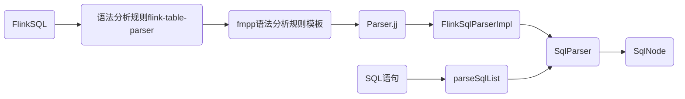

---
categories:
- code
date: 2023-05-27 01:08:14+08:00
draft: false
subtitle: SQL语句到SqlNode
tags:
- flink
- calcite
- sql
- javacc
title: FlinkSQL - SQL语句到SqlNode
toc: true
---

<!--more-->
## parseSqlList

Sql语句从ParseImpl中调用CalciteParser的方法parseSqlList，将SQL语句转换成SqlNode

```java
// org.apache.flink.table.planner.parse.CalciteParser

 public SqlNodeList parseSqlList(String sql) {
        try {
            SqlParser parser = SqlParser.create(sql, config);
            return parser.parseStmtList();
        } catch (SqlParseException e) {
            if (e.getMessage().contains("Encountered \"<EOF>\"")) {
                throw new SqlParserEOFException(e.getMessage(), e);
            }
            throw new SqlParserException("SQL parse failed. " + e.getMessage(), e);
        }
    }
```
其中 parser 的创建 使用到了 calcite 的 SqlParser实例  
生成 SqlParser 需要两个参数
- sql String 类型，就是传入的Sql字符串
- config SqlParser.Config类型

### SqlParser.Config 
Flink 在解析sqlQuery 或者 createTemporaryView 这类操作SQL的处理中，就会创建CalciteParser,在创建CalciteParser的时候会调用
```javacc
getSqlParserConfig()
```
的方法获取SqlParser.Config 
```java
// org.apache.flink.table.planner.delegation.PlannerContext
/**
     * Returns the SQL parser config for this environment including a custom Calcite configuration.
     */
    private SqlParser.Config getSqlParserConfig() {
        return JavaScalaConversionUtil.<SqlParser.Config>toJava(
                        getCalciteConfig().getSqlParserConfig())
                .orElseGet(
                        // we use Java lex because back ticks are easier than double quotes in
                        // programming and cases are preserved
                        () -> {
                            SqlConformance conformance = getSqlConformance();
                            return SqlParser.config()
                                    .withParserFactory(FlinkSqlParserFactories.create(conformance))
                                    .withConformance(conformance)
                                    .withLex(Lex.JAVA)
                                    .withIdentifierMaxLength(256);
                        });
    }
```
如果设置了Calicte的一些配置，那么就会在这里被读取出来自定义的CalicteParser，
否则，走orElseGet信息

SqlParser在这里设置了解析SQL的语法、词法、方言以及限定词的最大长度


#### SqlConformance

SqlConformance 是用来设置 SQL的方言(或标准)的 
在FlinkSQL中一共有两种方言，
- Calcite 默认方言
- Hive 方言


#### FlinkSqlParserFactories

```java
/** A util method to create SqlParserImplFactory according to SqlConformance. */
public class FlinkSqlParserFactories {

    private FlinkSqlParserFactories() {}

    public static SqlParserImplFactory create(SqlConformance conformance) {
        if (conformance == FlinkSqlConformance.DEFAULT) {
            return FlinkSqlParserImpl.FACTORY;
        } else {
            throw new TableException("Unsupported SqlConformance: " + conformance);
        }
    }
}
```
这里就很有意思，FlinkSqlParser只接受Calcite默认方言  
然后再看FlinkSqlParserImpl
```java
// package org.apache.flink.sql.parser.impl;

/**
 * SQL parser, generated from Parser.jj by JavaCC.
 *
 * <p>The public wrapper for this parser is {@link SqlParser}.
 */
public class FlinkSqlParserImpl extends SqlAbstractParserImpl implements FlinkSqlParserImplConstants {
    private static final Logger LOGGER = CalciteTrace.getParserTracer();

```

可以看出，FlinkSqlParserImpl 是通过JavaCC生成的  
生成此类的 JavaCC 文件 在
```
flink-table/flink-sql-parser/target/generated-sources/javacc/Parser.jj
```
而这个应该是根据 FreeMarker的模板fmpp来生成的,打开 flink-sql-parser 下面 codegen里面的config.fmpp，我们可以发现一下一段话，答题意思就是说FMPP继承了CalciteParser，然后解析指定的Sql
```bash
# This file is an FMPP (http://fmpp.sourceforge.net/) configuration file to
# allow clients to extend Calcite's SQL parser to support application specific
# SQL statements, literals or data types.
#
# Calcite's parser grammar file (Parser.jj) is written in javacc
# (https://javacc.org/) with Freemarker (http://freemarker.org/) variables
# to allow clients to:
#   1. have custom parser implementation class and package name.
#   2. insert new parser method implementations written in javacc to parse
#      custom:
#      a) SQL statements.
#      b) literals.
#      c) data types.
#   3. add new keywords to support custom SQL constructs added as part of (2).
#   4. add import statements needed by inserted custom parser implementations.
#
# Parser template file (Parser.jj) along with this file are packaged as
# part of the calcite-core-<version>.jar under "codegen" directory.
```
简单看一下这个jj文件，可以发现，就是在定义SQL如何声明，以及如何处理SQL语句的
```java
SqlLiteral AllOrDistinct() :
{
}
{
    <DISTINCT> { return SqlSelectKeyword.DISTINCT.symbol(getPos()); }
|
    <ALL> { return SqlSelectKeyword.ALL.symbol(getPos()); }
}
```
在 flink-sql-parser 中还可以看到生成这些FlinkSQL的逻辑，比如这种 Flink的建表语句如何判断的逻辑，都在这里可以找到  

```java
// org.apache.flink.sql.parser.ddl
public class SqlCreateTable extends SqlCreate implements ExtendedSqlNode {

    public static final SqlSpecialOperator OPERATOR =
            new SqlSpecialOperator("CREATE TABLE", SqlKind.CREATE_TABLE);
...
 writer.keyword("CREATE");
        if (isTemporary()) {
            writer.keyword("TEMPORARY");
        }
        writer.keyword("TABLE");
        if (isIfNotExists()) {
            writer.keyword("IF NOT EXISTS");
        }
        tableName.unparse(writer, leftPrec, rightPrec);
        if (columnList.size() > 0 || tableConstraints.size() > 0 || watermark != null) {
            SqlUnparseUtils.unparseTableSchema(
                    writer, leftPrec, rightPrec, columnList, tableConstraints, watermark);
        }

        if (comment != null) {
            writer.newlineAndIndent();
            writer.keyword("COMMENT");
            comment.unparse(writer, leftPrec, rightPrec);
        }
...

```
返回jj文件中，我们可以看出一条SQL语句是如何拆分成一步一步拆分成SqlNode的过程

```java
SqlNodeList SqlStmtList() :
{
    final List<SqlNode> stmtList = new ArrayList<SqlNode>();
    SqlNode stmt;
}
{
    stmt = SqlStmt() {
        stmtList.add(stmt);
    }
    (
        <SEMICOLON>
        [
            stmt = SqlStmt() {
                stmtList.add(stmt);
            }
        ]
    )*
    <EOF>
    {
        return new SqlNodeList(stmtList, Span.of(stmtList).pos());
    }
}

```

#### Lex

Calcite 中的 Lex 是一个词法分析器，用于将输入的 SQL 语句转换为一系列的词法单元（tokens）。这些词法单元可以被后续的语法分析器（parser）用来构建语法树。

举个例子，假设我们有一个 SQL 查询语句：

SELECT name, age FROM users WHERE age > 18;
Lex 会将这个语句分解为以下词法单元：

```lex
SELECT
name
,
age
FROM
users
WHERE
age
>
18
;
```
这些词法单元可以被 Calcite 中的语法分析器用来构建语法树，进而进行查询优化和执行

### SqlParser
了解了 SqlParser.Config的构成，SqlParser就更简单了创建过程就是将Config中的的数据拿出来
```java
  //~ Constructors -----------------------------------------------------------
  private SqlParser(SqlAbstractParserImpl parser,
      Config config) {
    this.parser = parser;
    parser.setTabSize(1);
    parser.setQuotedCasing(config.quotedCasing());
    parser.setUnquotedCasing(config.unquotedCasing());
    parser.setIdentifierMaxLength(config.identifierMaxLength());
    parser.setConformance(config.conformance());
    parser.switchTo(SqlAbstractParserImpl.LexicalState.forConfig(config));
  }
```
其中parser.switchTo 用于切换解析器的状态
具体来说，switchTo方法接受一个参数，表示要切换到的状态。在解析SQL语句的过程中，不同的状态对应着不同的语法规则和解析方式。通过切换状态，解析器可以根据当前的语法规则和上下文信息，正确地解析SQL语句。
举个例子，假设我们有一个SQL语句：
```sql
SELECT name, age FROM users WHERE age > 18;
```
在解析这个SQL语句时，解析器需要根据不同的关键字和符号，判断当前的语法状态。比如，在解析SELECT关键字时，解析器需要切换到SELECT状态；在解析FROM关键字时，解析器需要切换到FROM状态；在解析WHERE关键字时，解析器需要切换到WHERE状态。
具体的实现可以参考SqlAbstractParserImpl类的源代码。

所以一条字符串类型的Sql语句 转换成 SqlNode 的流程应该就是 

