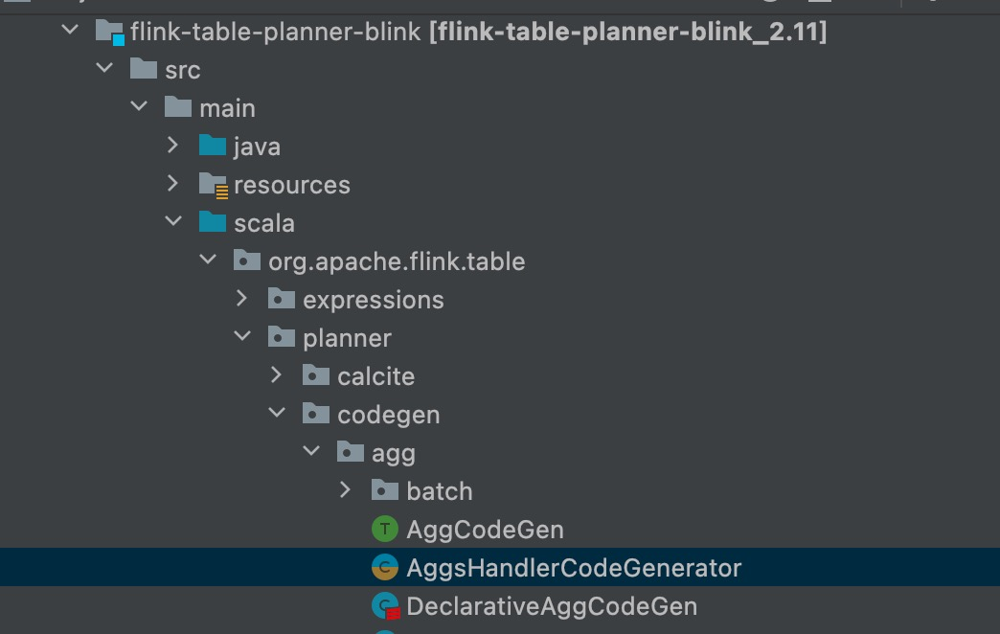

# Flink AggHandlerCodeGenerator

# 介绍
AggHandlerCodeGenerator 的代码在 flink planner 下，用来生成聚合函数的代码,是scala 代码


## 类定义

```
classDiagram
    class AggsHandlerCodeGenerator{
    +CodeGeneratorContext ctx
    +RelBuilder relBuilder
    +Seq~LogicalType~ inputFieldTypes
    +Boolean copyInputField
    +RowType inputType 
    +Seq~RexLiteral~ constants
    -Seq~GeneratedExpression~ constantExprs
    -String namespaceClassName
    -Seq~PlannerWindowProperty~ windowProperties
    -Boolean hasNamespace
    -RowType accTypeInfo
    -Int aggBufferSize
    -Array~DataType~ mergedAccExternalTypes
    -Int mergedAccOffset
    -Boolean mergedAccOnHeap
    -Array~Int~  ignoreAggValues
    -Boolean isAccumulateNeeded  
    -Boolean isRetractNeeded  
    -Boolean isMergeNeeded  
    +RowType  valueType: 
    -Array~AggCodeGen~ aggBufferCodeGens
    -Array~AggCodeGen~ aggActionCodeGens
    +AggsHandlerCodeGenerator withConstants(Seq~RexLiteral~ literals ): 
    }
```

```scala
package org.apache.flink.table.planner.codegen.agg


class AggsHandlerCodeGenerator(
    ctx: CodeGeneratorContext, // 上下文
    relBuilder: RelBuilder, // 用来生成关系表达式
    inputFieldTypes: Seq[LogicalType],
    copyInputField: Boolean // 需要缓存时将此字段设置为true) {

  private val inputType = RowType.of(inputFieldTypes: _*) 

  /** 常量表达式 */
  private var constants: Seq[RexLiteral] = Seq()
  private var constantExprs: Seq[GeneratedExpression] = Seq()

  /** 窗口相关参数，窗口聚合才会用到 */
  private var namespaceClassName: String = _
  private var windowProperties: Seq[PlannerWindowProperty] = Seq()
  private var hasNamespace: Boolean = false

  /** 聚合信息 */
  private var accTypeInfo: RowType = _
  private var aggBufferSize: Int = _

  private var mergedAccExternalTypes: Array[DataType] = _
  private var mergedAccOffset: Int = 0
  private var mergedAccOnHeap: Boolean = false

  private var ignoreAggValues: Array[Int] = Array()

  private var isAccumulateNeeded = false
  private var isRetractNeeded = false
  private var isMergeNeeded = false

  var valueType: RowType = _

  /**
    * 生成 [[AggsHandleFunction]] 或者 [[NamespaceAggsHandleFunction]] 会创建 [[aggBufferCodeGens]] and [[aggActionCodeGens]] 两者包含相同的AggCodeGens，aggBufferCodeGens 以列表的扁平形式， aggActionCodeGens是树形结构
    在没有distinct 的的情况下，两者相同
  */

  /**  
    aggBufferCodeGens 用于生成相关累加器(Accumulator)的 方法
    */
  private var aggBufferCodeGens: Array[AggCodeGen] = _

  /**
   aggActionCodeGens 树形结构，聚合distinct数据的时候，会将相同需要distinct的字段组成树结构
    */
  private var aggActionCodeGens: Array[AggCodeGen] = _


object aggshandlercodegenerator {

  /** static terms **/
  val acc_term = "acc"
  val merged_acc_term = "otheracc"
  val accumulate_input_term = "accinput"
  val retract_input_term = "retractinput"
  val distinct_key_term = "distinctkey"

  val namespace_term = "namespace"
  val store_term = "store"

  val collector: string = classname[collector[_]]
  val collector_term = "out"
  val member_collector_term = "convertcollector"
  val convert_collector_type_term = "convertcollector"
  val key_term = "groupkey"

  val input_not_null = false

}

```
如果一个SQL的结构如下

```sql
 count(*), count(distinct a), count(distinct a) filter d > 5, sum(a), sum(distinct a)
     +----------+-----------+-----------+---------+---------+----------------+
     | count(*) | count(a') | count(a') |  sum(a) | sum(a') | distinct(a) a' |
     +----------+-----------+-----------+---------+---------+----------------+

```
那么 aggBufferCodeGens 会这样保存

```goat
┌────────┬──────────┬──────────┬───────┬────────┬────────────┐
│count(*)│ count(a')│ count(a')│ sum(a)│ sum(a')│ distinct(a)│
└────────┴──────────┴──────────┴───────┴────────┴────────────┘
```

aggActionCodeGens 会这样保存

```goat
┌─────────────────────────────┬───────┬────────────────────────────────┐
│    count(*)                 │ sum(a)│  distinct(a) a'                │
│                             │       │    ├─count(a')                 │
│                             │       │    ├─count(a') (filter d > 5)  │
│                             │       │    └─sum(a')                   │
└─────────────────────────────┴───────┴────────────────────────────────┘

```

### CodeGeneratorContext

```scala
package org.apache.flink.table.planner.codegen

/**
  生成代码的上下文，维护代码段的状态
  */
class CodeGeneratorContext(val tableConfig: TableConfig) {

  // 保存用于传递生成类的对象列表
  val references: mutable.ArrayBuffer[AnyRef] = new mutable.ArrayBuffer[AnyRef]()

  // 插入有序，只会被添加一次， 成员状态
  private val reusableMemberStatements: mutable.LinkedHashSet[String] =
    mutable.LinkedHashSet[String]()

  // 插入有序，只会被添加一次， 构造状态
  private val reusableInitStatements: mutable.LinkedHashSet[String] =
    mutable.LinkedHashSet[String]()

  // 插入有序，只会被添加一次， RichFunction 中open方法的状态
  private val reusableOpenStatements: mutable.LinkedHashSet[String] =
    mutable.LinkedHashSet[String]()

  // 插入有序，只会被添加一次， RichFunction 中close方法的状态
  private val reusableCloseStatements: mutable.LinkedHashSet[String] =
    mutable.LinkedHashSet[String]()

  // 插入有序，只会被添加一次， 清理 dataview 的状态
  private val reusableCleanupStatements = mutable.LinkedHashSet[String]()

  // 单个记录的状态， 插入有序，因为本地变量需要被分割，所以本地变量无法访问，只能更新成员变量
  private val reusablePerRecordStatements: mutable.LinkedHashSet[String] =
    mutable.LinkedHashSet[String]()

  // (inputTerm, index) -> expr
  // 只会被添加一次， 初始化拆箱表达式Map
  val reusableInputUnboxingExprs: mutable.Map[(String, Int), GeneratedExpression] =
    mutable.Map[(String, Int), GeneratedExpression]()

  // 插入有序，只会被添加一次，构造函数的状态
  private val reusableConstructorStatements: mutable.LinkedHashSet[(String, String)] =
    mutable.LinkedHashSet[(String, String)]()

  // 插入有序，只会被添加一次，类声明状态
  private val reusableInnerClassDefinitionStatements: mutable.Map[String, String] =
    mutable.Map[String, String]()

  // string_constant -> reused_term
  // 常量
  private val reusableStringConstants: mutable.Map[String, String] = mutable.Map[String,  String]()

  // LogicalType -> reused_term
  // 类型序列化
  private val reusableTypeSerializers: mutable.Map[LogicalType, String] =
    mutable.Map[LogicalType,  String]()


  /**
   * Flag map that indicates whether the generated code for method is split into several methods.
   */
  private val isCodeSplitMap = mutable.Map[String, Boolean]()

  // method_name -> local_variable_statements
  private val reusableLocalVariableStatements = mutable.Map[String, mutable.LinkedHashSet[String]](
    (currentMethodNameForLocalVariables, mutable.LinkedHashSet[String]()))

```

