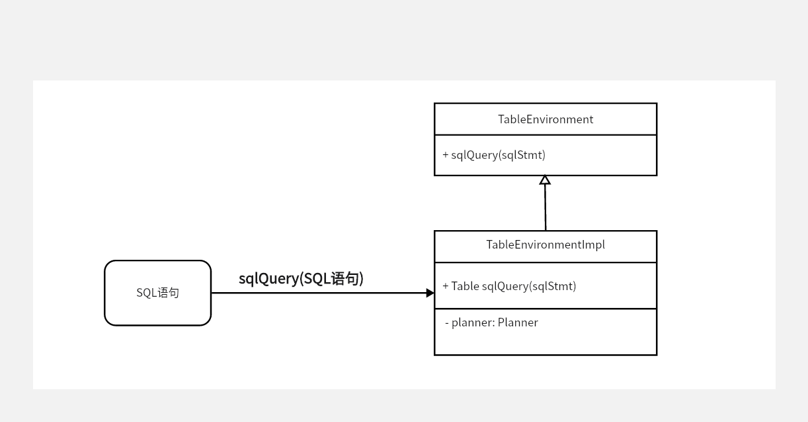

# FlinkSQL - 开始


## flink 参数

| 参数      | 说明 |
| --------- | ---- |
| flink 版本 | 1.17 |
| java 版本  | 1.8 |

## 测试SQL

```SQL
select * 
from  tableA 
where amount > 2
```

## 运行环境

```java
        final StreamExecutionEnvironment env = StreamExecutionEnvironment.getExecutionEnvironment();

        final StreamTableEnvironment tableEnv = StreamTableEnvironment.create(env);

        final DataStream<Order> orderA =
                env.fromCollection(
                        Arrays.asList(
                                new Order(1L, "beer", 3),
                                new Order(1L, "diaper", 4),
                                new Order(3L, "rubber", 2)));

        final Table tableA = tableEnv.fromDataStream(orderA);

        final Table result =
                tableEnv.sqlQuery(
                    "select * from " + tableA + " where amount > 2"
                );

        tableEnv.toDataStream(result, Row.class).print();
        env.execute();
```

运行结果为
```text
(true,+I[1, beer, 3, 2, pen, 3])
(true,+I[1, beer, 3, 2, rubber, 3])
```

## SQL流程


一条SQL语句 通过Calcite 转换成 物理计划，物理计划通过代码生成计划转换成Flink Transformation 从而最终转换成 Flink 的执行图

从代码来看 
    
    tableEnv.sqlQuery()

将sql 语句转换成了 逻辑计划 -> 物理计划

    env.execute()

生成StreamGraph 最终执行语句

### sqlQuery



sqlQuery 会把 输入的 SQL 语句转换成Operation
> Operation 就是对于表的所有操作(DML, DDL, DQL, DCL) 
> 
> Covers all sort of Table operations such as queries(DQL), modifications(DML), definitions(DDL), or control actions(DCL).  This is the output of Planner.getParser() and Parser.parse(String).

在这里，Operation就是一个PlannerQueryOperation，里面包含了RelNode的信息。Operation 会包装成Table 对象返回

```java    @Override
    public Table sqlQuery(String query) {
        /**
         * 这里会解析Sql语句转换成关系代数
         */
        List<Operation> operations = getParser().parse(query);

        if (operations.size() != 1) {
            throw new ValidationException(
                    "Unsupported SQL query! sqlQuery() only accepts a single SQL query.");
        }

        Operation operation = operations.get(0);

        if (operation instanceof QueryOperation && !(operation instanceof ModifyOperation)) {
            /**
             * 这里将转换的Operation转换成Flink Table API可以识别的Table对象
             */
            return createTable((QueryOperation) operation);
        } else {
            throw new ValidationException(
                    "Unsupported SQL query! sqlQuery() only accepts a single SQL query of type "
                            + "SELECT, UNION, INTERSECT, EXCEPT, VALUES, and ORDER_BY.");
        }
    }
```

---

> 作者: toxi  
> URL: https://example.com/flink-prefix/  

