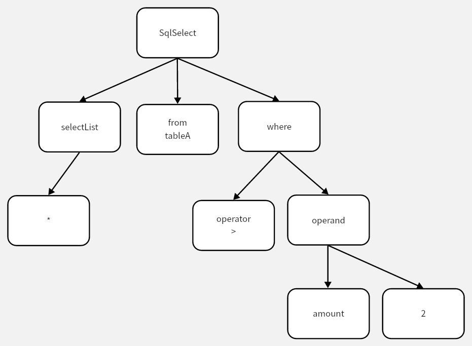
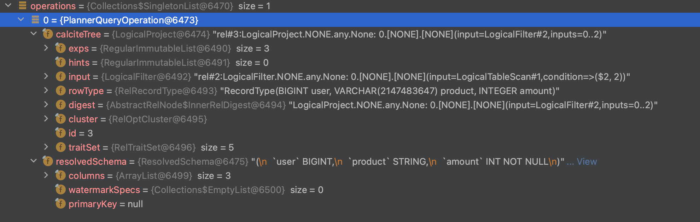
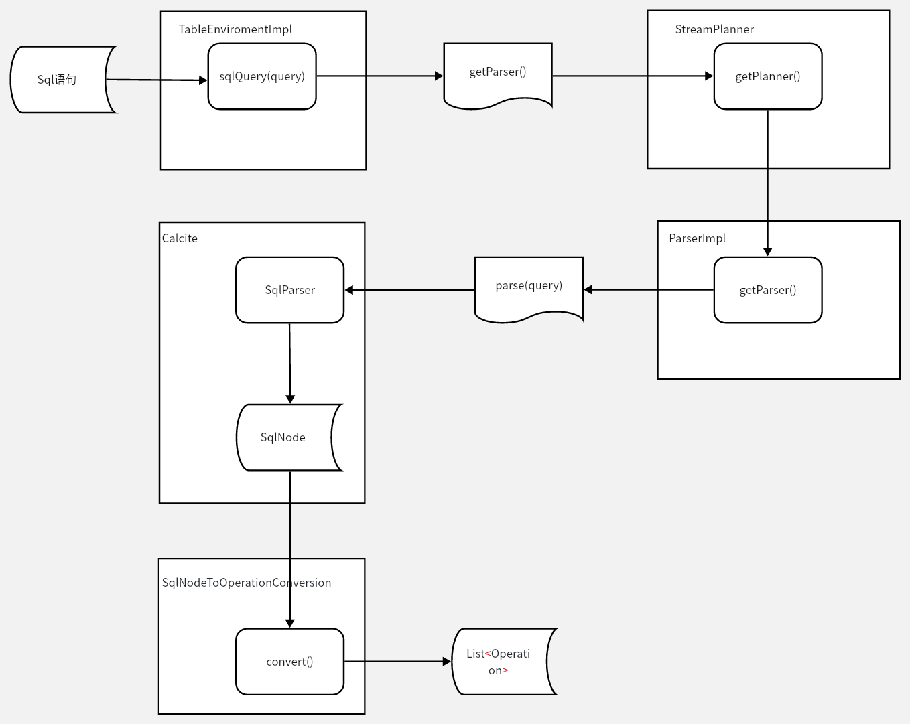

# Flink SqlQuery

## SqlQuery 

```java
List<Operation> operations = getParser().parse(query);
```

sqlQuery 获取Parser，就是 Planner的Parser

```java
@Override
public Parser getParser() {
    return getPlanner().getParser();
}

@VisibleForTesting
public Planner getPlanner() {
    return planner;
}

```

StreamTableEnvironment 在创建的过程中会创建 Planner


```java
final Planner planner =
            PlannerFactoryUtil.createPlanner(
                        executor,
                        tableConfig,
                        userClassLoader,
                        moduleManager,
                        catalogManager,
                        functionCatalog);
```

其中，
- executor
  - 用于执行Planner的对象
- tableConfig
  - table和SQL的配置项，比如 checkpoint，watermark等
- userClassLoader
  - 用户动态类加载器
  - 默认的使用org.apache.flink.util.FlinkUserCodeClassLoaders来创建的
- moduleManager
  - 模块管理器，会将CoreModule的模块加入到管理器中
  - module 就是 定义的一系列元数据，包括函数、规则、操作符等

> Modules define a set of metadata, including functions, user defined types, operators, rules, etc. Metadata from modules are regarded as built-in or system metadata that users can take advantages of.

- catalogManager
  - 用于处理 catalog，封装catalog和一些临时表对象
  - catalog 提供了元数据信息，用来管理元数据信息(如table、view、function 和 type等)，提供了一套api，可以使用Table API和SQL来访问

> This interface is responsible for reading and writing metadata such as database/table/views/UDFs from a registered catalog. It connects a registered catalog and Flink's Table API. This interface only processes permanent metadata objects. In order to process temporary objects, a catalog can also implement the TemporaryOperationListener interface.
- functionCatalog
  - 函数catalog，保存函数的定义
  - 注册的函数就会放在这个对象中，像UDF 等注册的catalog也会放在这里
  - [FLIP-65](https://cwiki.apache.org/confluence/display/FLINK/FLIP-65%3A+New+type+inference+for+Table+API+UDFs)

> Simple function catalog to store FunctionDefinitions in catalogs.
Note: This class can be cleaned up a lot once we drop the methods deprecated as part of FLIP-65. In the long-term, the class should be a part of catalog manager similar to DataTypeFactory.

PlannerFactoryUtil.createPlanner 方法会先找到 PlannerFactory（默认是 DefaultPlannerFactory）然后根据 TableConfig 中的execution.runtime-mode 确认启动的任务是流任务还是批任务，进而创建Planner(SteamPlanner)
```java
    @Override
    public Planner create(Context context) {
        final RuntimeExecutionMode runtimeExecutionMode =
                context.getTableConfig().get(ExecutionOptions.RUNTIME_MODE);
        switch (runtimeExecutionMode) {
            case STREAMING:
                return new StreamPlanner(
                        context.getExecutor(),
                        context.getTableConfig(),
                        context.getModuleManager(),
                        context.getFunctionCatalog(),
                        context.getCatalogManager(),
                        context.getClassLoader());
            case BATCH:
                return new BatchPlanner(
                        context.getExecutor(),
                        context.getTableConfig(),
                        context.getModuleManager(),
                        context.getFunctionCatalog(),
                        context.getCatalogManager(),
                        context.getClassLoader());
            default:
                throw new TableException(
                        String.format(
                                "Unsupported mode '%s' for '%s'. Only an explicit BATCH or "
                                        + "STREAMING mode is supported in Table API.",
                                runtimeExecutionMode, RUNTIME_MODE.key()));
        }
    }
```

Planner的Parser, 就是用来解析SQL语句的, Parser 目前分为两种SQL方言 flink 默认的SQL 和 Hive 
    
```java
    @PublicEvolving
    public enum SqlDialect {

    /** Flink's default SQL behavior. */
    DEFAULT,

    /**
     * SQL dialect that allows some Apache Hive specific grammar.
     *
     * <p>Note: We might never support all of the Hive grammar. See the documentation for supported
     * features.
     */
    HIVE
}
```

默认情况下 我们创建出来的的Parser(ParserImpl) 是使用Calcite进行解析的
```java
    /**
     * 这里的 context 就是根据planner 的信息创建的
     * parser = parserFactory.create(new DefaultCalciteContext(catalogManager, plannerContext))
     * 
     */
    @Override
    public Parser create(Context context) {
        DefaultCalciteContext defaultCalciteContext = (DefaultCalciteContext) context;
        return new ParserImpl(
                defaultCalciteContext.getCatalogManager(),
                defaultCalciteContext.getPlannerContext()::createFlinkPlanner,
                defaultCalciteContext.getPlannerContext()::createCalciteParser,
                defaultCalciteContext.getPlannerContext().getRexFactory());
    }
```
createFlinkPlanner 的实现是FlinkPlannerImpl，在这里是共享 flink table API 和 Sql 的 plan 的 在parser中主要负责验证SQL 数据类型等操作
createCalciteParser 包装了一下 Calcite的 SqlParser
```java
public FlinkPlannerImpl createFlinkPlanner() {
        return new FlinkPlannerImpl(
                createFrameworkConfig(), this::createCatalogReader, typeFactory, cluster);
    }

    public CalciteParser createCalciteParser() {
        return new CalciteParser(getSqlParserConfig());
    }


```

## ParserImpl 

默认的ParserImpl的类定义
```

classDiagram
    class ParserImpl {
        - final CatalogManager catalogManager
        - final Supplier<FlinkPlannerImpl> validatorSupplier
        - final Supplier<CalciteParser> calciteParserSupplier
        - final RexFactory rexFactory
        - static final ExtendedParser EXTENDED_PARSER
        +parse(String statement) List~Operation~
    }

```
```java
    public ParserImpl(
            CatalogManager catalogManager,
            Supplier<FlinkPlannerImpl> validatorSupplier,
            Supplier<CalciteParser> calciteParserSupplier,
            RexFactory rexFactory) {
        this.catalogManager = catalogManager;
        this.validatorSupplier = validatorSupplier;
        this.calciteParserSupplier = calciteParserSupplier;
        this.rexFactory = rexFactory;
    }
```

parse 的过程就是调用 CalciteParser 将 Sql 语句转换成SqlNode的过程，Calcite会调用JavaCC来解析SQL语句  
然后经过转换 把 sqlNode转换成Operation 在这里如果有一些特殊的SQL解析 会放到EXTENDED_PARSER 里面进行解析

```java
    @Override
    public List<Operation> parse(String statement) {
        CalciteParser parser = calciteParserSupplier.get();
        FlinkPlannerImpl planner = validatorSupplier.get();

        Optional<Operation> command = EXTENDED_PARSER.parse(statement);
        if (command.isPresent()) {
            return Collections.singletonList(command.get());
        }

        // parse the sql query
        // use parseSqlList here because we need to support statement end with ';' in sql client.
        SqlNodeList sqlNodeList = parser.parseSqlList(statement);
        List<SqlNode> parsed = sqlNodeList.getList();
        Preconditions.checkArgument(parsed.size() == 1, "only single statement supported");
        return Collections.singletonList(
                SqlNodeToOperationConversion.convert(planner, catalogManager, parsed.get(0))
                        .orElseThrow(() -> new TableException("Unsupported query: " + statement)));
    }
```

例如， SQL语句 

```sql
select * from tableA where amount > 2
```
经过 CalciteParser 就会 生成一个 SqlNode
  

最后经过SqlNodeToOperationConversion.convert 会转换成 包含逻辑计划的operation  
  

目前流程为


---

> 作者: toxi  
> URL: https://example.com/flink-sqlquery/  

