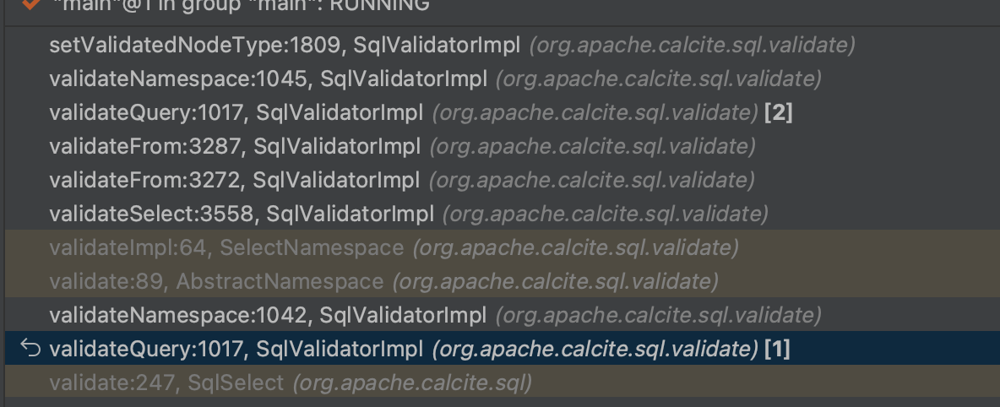

# FlinkSQL - 类型验证


<!--more-->
当 SqlValidator解析完作用域信息之后，紧接着就开始对类型进行验证 
```java
 @Override
    public SqlNode validate(SqlNode topNode) {
        SqlValidatorScope scope = new EmptyScope(this);
        scope = new CatalogScope(scope, ImmutableList.of("CATALOG"));
        final SqlNode topNode2 = validateScopedExpression(topNode, scope);
        final RelDataType type = getValidatedNodeType(topNode2);
        Util.discard(type);
        return topNode2;
    }
```

## getValidatedNodeType 

每个SqlNode 都会设定一个类型比如，
```sql
SELECT * FROM table WHERE column1 + column2 = 10
```
在解析完成后，“*” 会被解开变成user, product, amoutn， 就会被设定成这样一个类型
RecordType(BIGINT user, VARCHAR(2147483647) product, INTEGER amount)
```java
    @Override
    public RelDataType getValidatedNodeType(SqlNode node) {
        RelDataType type = getValidatedNodeTypeIfKnown(node);
        if (type == null) {
            if (node.getKind() == SqlKind.IDENTIFIER) {
                throw newValidationError(node, RESOURCE.unknownIdentifier(node.toString()));
            }
            throw Util.needToImplement(node);
        } else {
            return type;
        }
    }
```

```java
 @Override
    public @Nullable RelDataType getValidatedNodeTypeIfKnown(SqlNode node) {
        final RelDataType type = nodeToTypeMap.get(node);
        if (type != null) {
            return type;
        }
        final SqlValidatorNamespace ns = getNamespace(node);
        if (ns != null) {
            return ns.getType();
        }
        final SqlNode original = originalExprs.get(node);
        if (original != null && original != node) {
            return getValidatedNodeType(original);
        }
        if (node instanceof SqlIdentifier) {
            return getCatalogReader().getNamedType((SqlIdentifier) node);
        }
        return null;
    }
```

这里的 nodeToTypeMap 是在validateScopedExpression 这一步就确定了的，整个过程是在 验证命名空间的过程汇总就写入了，当然也是递归的过程


type 类型推断 是通过 SqlValidatorScope 实现这个接口实现的  
每个SqlNode 都对应一个 Scope 在这些Scope中定义规则

```java
/** Derives the type of a node, never null. */
    RelDataType deriveTypeImpl(SqlValidatorScope scope, SqlNode operand) {
        DeriveTypeVisitor v = new DeriveTypeVisitor(scope);
        final RelDataType type = operand.accept(v);
        return requireNonNull(scope.nullifyType(operand, type));
    }
```
于是，在 SqlValidatorImpl中可以找到事如何推导出这些类型是如何生成的

```java
private class DeriveTypeVisitor implements SqlVisitor<RelDataType> {
        private final SqlValidatorScope scope;

        DeriveTypeVisitor(SqlValidatorScope scope) {
            this.scope = scope;
        }

        @Override
        public RelDataType visit(SqlLiteral literal) {
            return literal.createSqlType(typeFactory);
        }

        @Override
        public RelDataType visit(SqlCall call) {
            final SqlOperator operator = call.getOperator();
            return operator.deriveType(SqlValidatorImpl.this, scope, call);
        }

        @Override
        public RelDataType visit(SqlNodeList nodeList) {
            // Operand is of a type that we can't derive a type for. If the
            // operand is of a peculiar type, such as a SqlNodeList, then you
            // should override the operator's validateCall() method so that it
            // doesn't try to validate that operand as an expression.
            throw Util.needToImplement(nodeList);
        }

        @Override
        public RelDataType visit(SqlIdentifier id) {
            // First check for builtin functions which don't have parentheses,
            // like "LOCALTIME".
            final SqlCall call = makeNullaryCall(id);
            if (call != null) {
                return call.getOperator().validateOperands(SqlValidatorImpl.this, scope, call);
            }

            RelDataType type = null;
            if (!(scope instanceof EmptyScope)) {
                id = scope.fullyQualify(id).identifier;
            }

            // Resolve the longest prefix of id that we can
            int i;
            for (i = id.names.size() - 1; i > 0; i--) {
                // REVIEW jvs 9-June-2005: The name resolution rules used
                // here are supposed to match SQL:2003 Part 2 Section 6.6
                // (identifier chain), but we don't currently have enough
                // information to get everything right.  In particular,
                // routine parameters are currently looked up via resolve;
                // we could do a better job if they were looked up via
                // resolveColumn.

                final SqlNameMatcher nameMatcher = catalogReader.nameMatcher();
                final SqlValidatorScope.ResolvedImpl resolved =
                        new SqlValidatorScope.ResolvedImpl();
                scope.resolve(id.names.subList(0, i), nameMatcher, false, resolved);
                if (resolved.count() == 1) {
                    // There's a namespace with the name we seek.
                    final SqlValidatorScope.Resolve resolve = resolved.only();
                    type = resolve.rowType();
                    for (SqlValidatorScope.Step p : Util.skip(resolve.path.steps())) {
                        type = type.getFieldList().get(p.i).getType();
                    }
                    break;
                }
            }

            // Give precedence to namespace found, unless there
            // are no more identifier components.
            if (type == null || id.names.size() == 1) {
                // See if there's a column with the name we seek in
                // precisely one of the namespaces in this scope.
                RelDataType colType = scope.resolveColumn(id.names.get(0), id);
                if (colType != null) {
                    type = colType;
                }
                ++i;
            }

            if (type == null) {
                final SqlIdentifier last = id.getComponent(i - 1, i);
                throw newValidationError(last, RESOURCE.unknownIdentifier(last.toString()));
            }

            // Resolve rest of identifier
            for (; i < id.names.size(); i++) {
                String name = id.names.get(i);
                final RelDataTypeField field;
                if (name.equals("")) {
                    // The wildcard "*" is represented as an empty name. It never
                    // resolves to a field.
                    name = "*";
                    field = null;
                } else {
                    final SqlNameMatcher nameMatcher = catalogReader.nameMatcher();
                    field = nameMatcher.field(type, name);
                }
                if (field == null) {
                    throw newValidationError(id.getComponent(i), RESOURCE.unknownField(name));
                }
                type = field.getType();
            }
            type = SqlTypeUtil.addCharsetAndCollation(type, getTypeFactory());
            return type;
        }

        @Override
        public RelDataType visit(SqlDataTypeSpec dataType) {
            // Q. How can a data type have a type?
            // A. When it appears in an expression. (Say as the 2nd arg to the
            //    CAST operator.)
            validateDataType(dataType);
            return dataType.deriveType(SqlValidatorImpl.this);
        }

        @Override
        public RelDataType visit(SqlDynamicParam param) {
            return unknownType;
        }

        @Override
        public RelDataType visit(SqlIntervalQualifier intervalQualifier) {
            return typeFactory.createSqlIntervalType(intervalQualifier);
        }
    }
```

至此，SqlNode的验证过程完毕，接下来就是将 SqlNode 转换成 Operation的过程了

---

> 作者: toxi  
> URL: https://example.com/flink-validate-type/  

