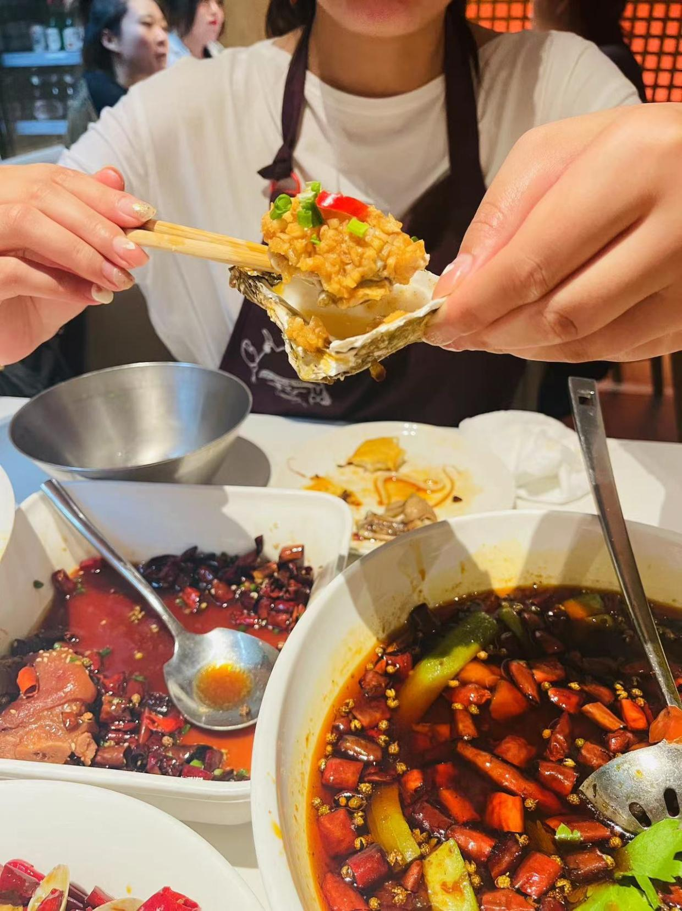
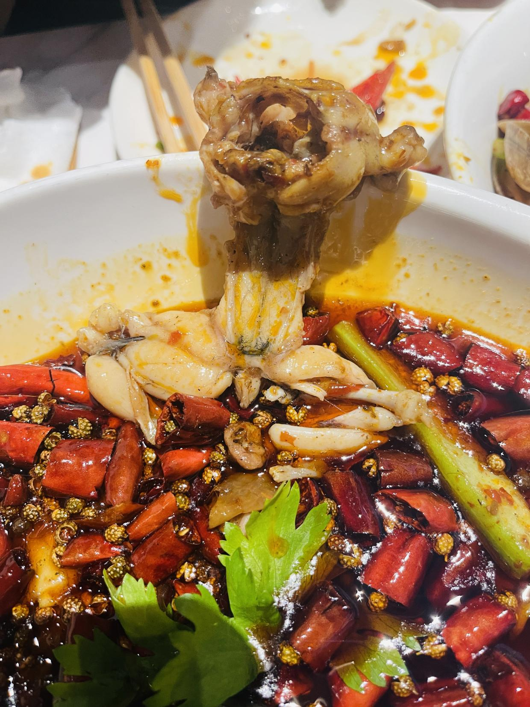
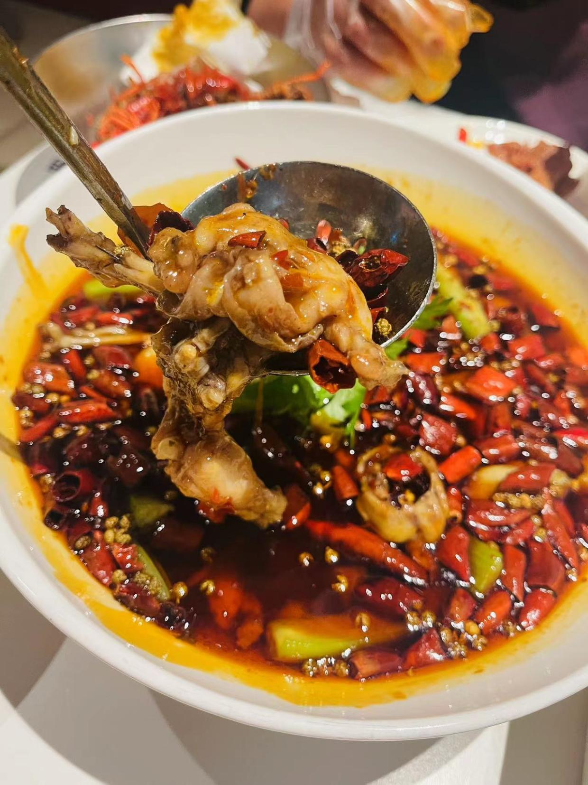
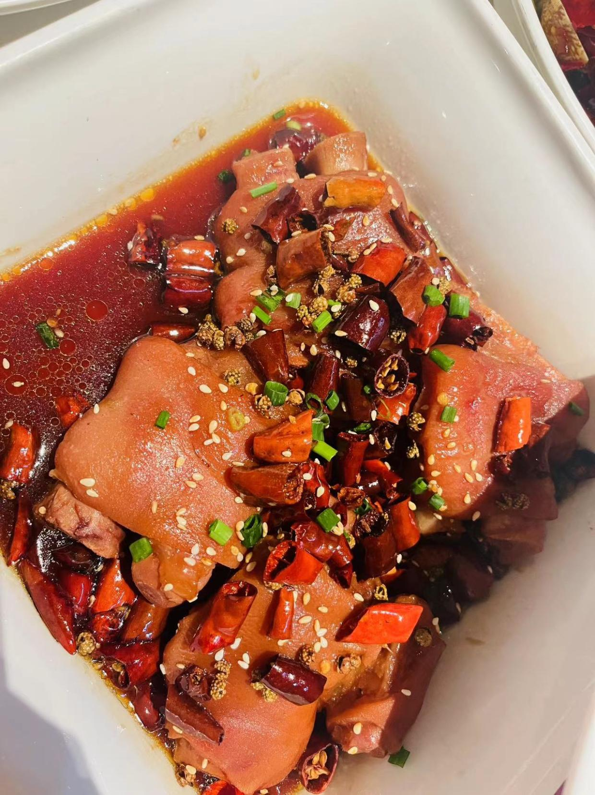
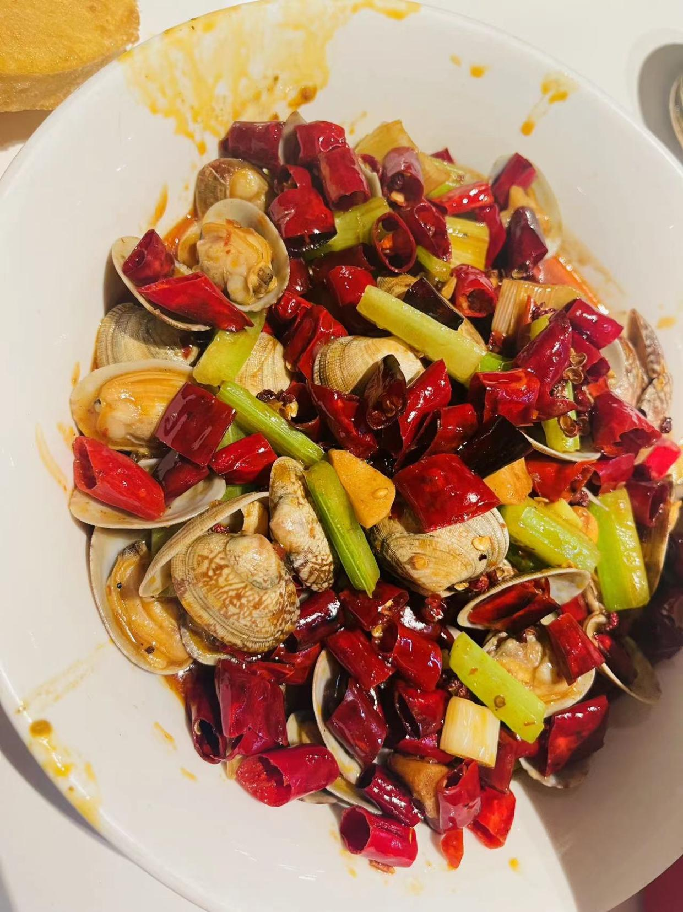
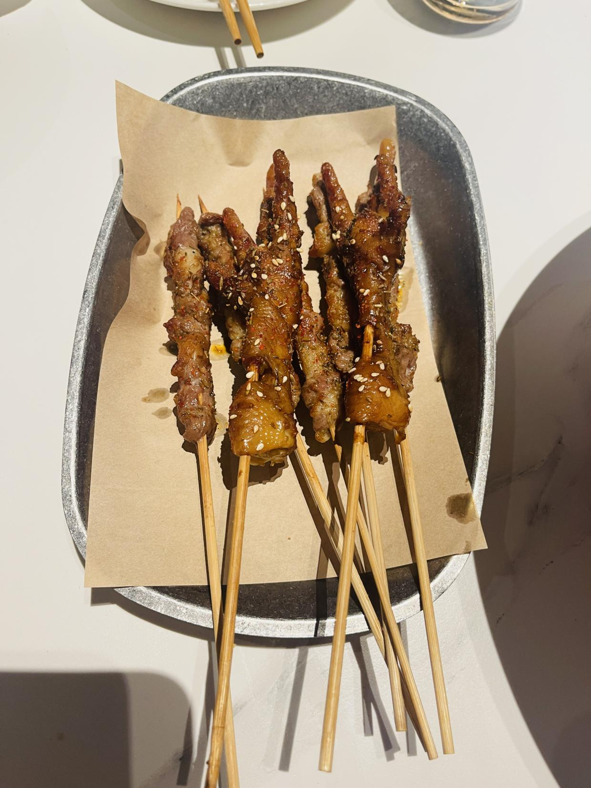
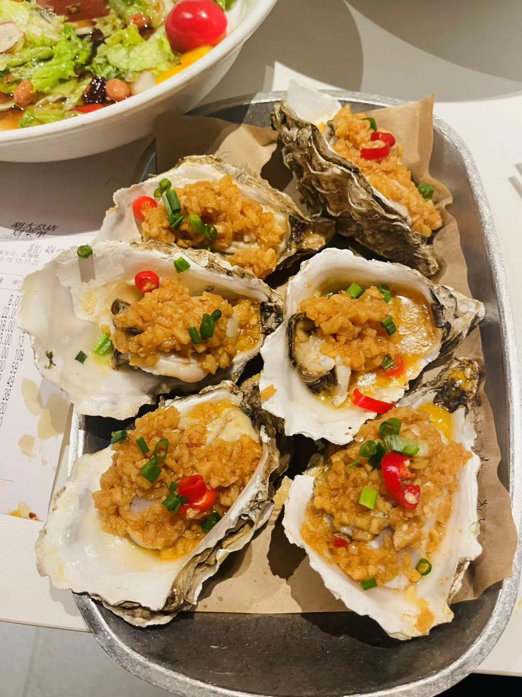
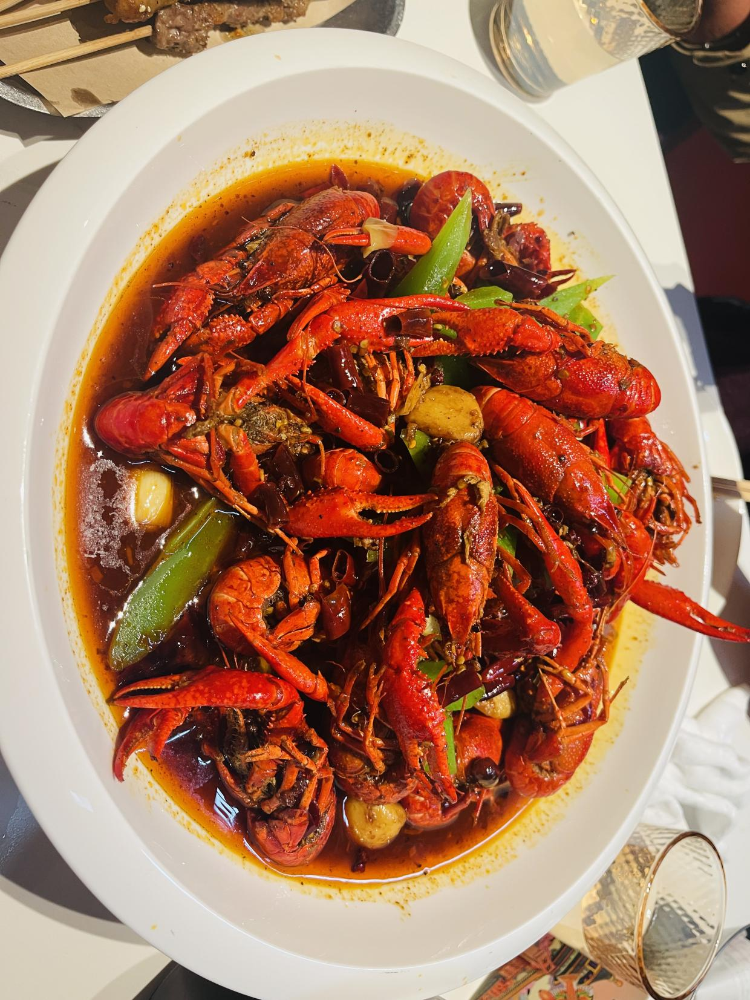
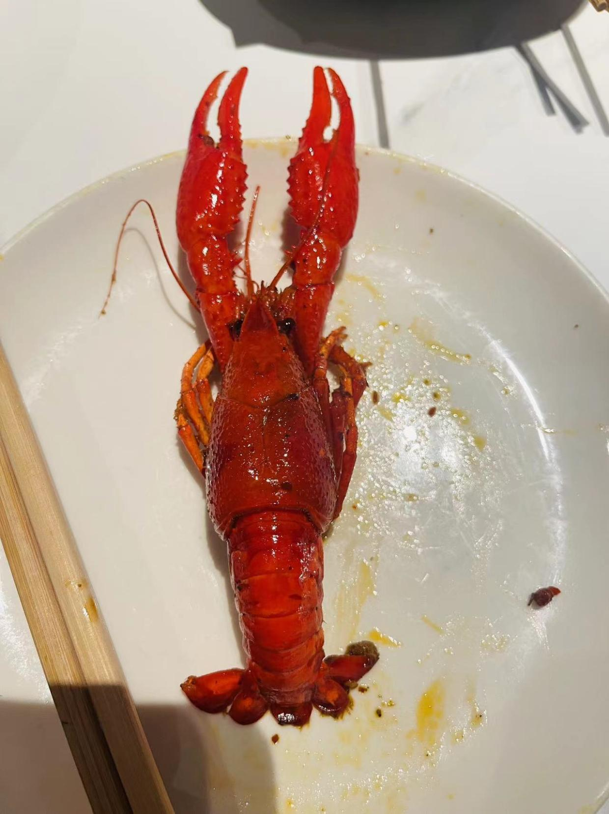

# 胡大饭馆

<!--more-->

## 记录
| 时间                   | 地址                          | 人数 | 排队等待 | 花销 |
| ---------------------- | ----------------------------- | ---- | -------- | ---- |
| 2023年05月19日13:30:00 | 北京市东城区东直门内大街233号 | 3    | 不用排队 | 574  |

## 一句话
看着别人吃还真挺香的~~

## 点餐

### 热菜

馋嘴蛙仔：很嫩，辣味十足，点了大份，量还是蛮大的，唯一不足的就是太咸了

香辣美容蹄：猪蹄软烂，辣味咸味刚刚好，点的菜里唯一一道没有那么辣

辣炒花蛤：花蛤很干净，有点辣还有一点类似香油的那种淡淡的香味，还是很不错的

### 烧烤

烤羊肉串：烤羊肉串还不错，后来又点了一份

烤生蚝：肉很厚，蒜香味没有浸入到里面
### 小龙虾

麻辣小龙虾：麻辣味很足，肉比较紧实，虾面往里面拌一下，吃着蛮爽的

## 总结
这家店名气很大，来了就是吃小龙虾的

---

> 作者: utopiacraft  
> URL: https://example.com/hudafanguan/  

