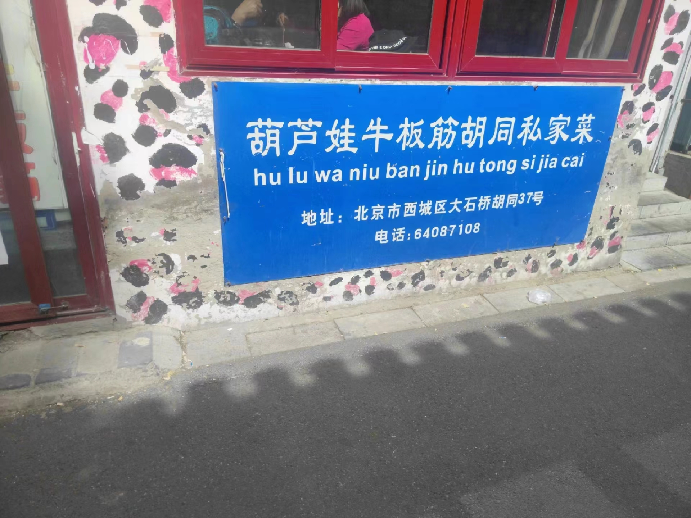
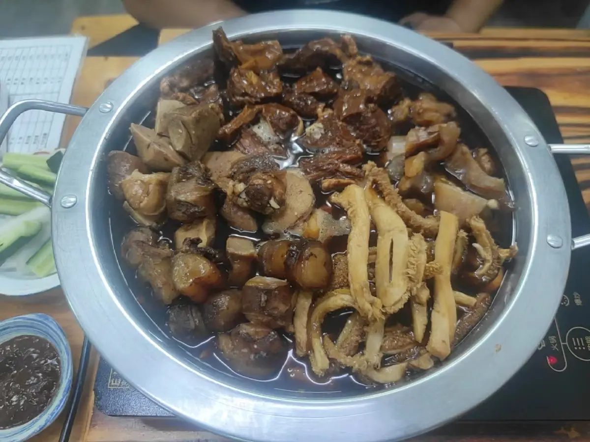
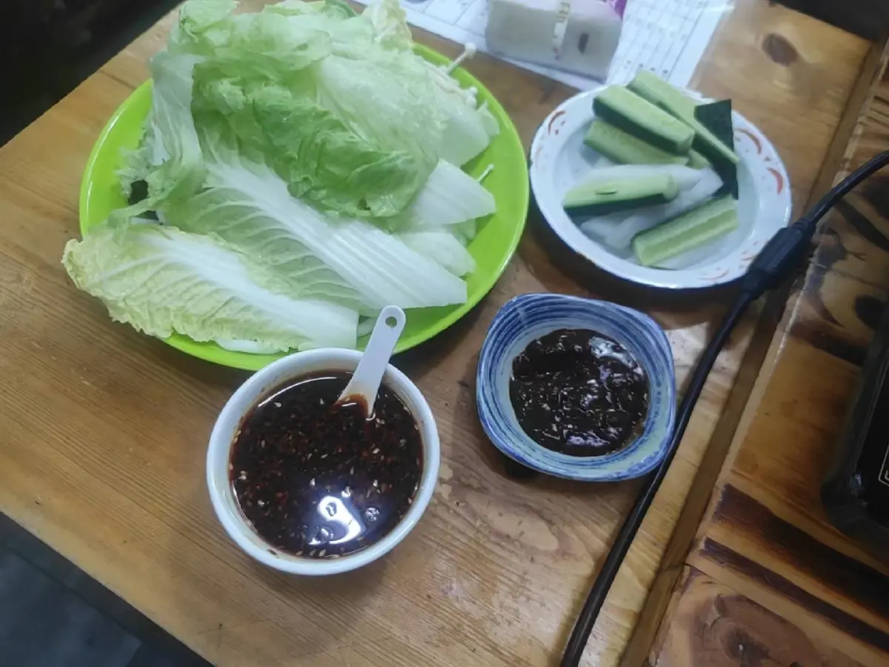

# 葫芦娃牛板筋胡同私房菜

<!--more-->

稍不注意，就走过了

## 记录
| 时间                   | 地址                         | 人数 | 排队等待 | 花销 |
| ---------------------- | ---------------------------- | ---- | -------- | ---- |
| 2023年10月05日13:10:00 | 北京市西城区大石桥胡同甲37号 | 2    | 10分钟   | 252  |

## 一句话
哥们几个来吃一顿还是挺舒服的，吃好吃饱

## 点餐
### 火锅

爆炸锅：牛肉很烂，很香，牛肚、牛板筋等没有异味，都很有嚼劲，豆腐也很香，回味无穷

### 配菜

配菜小料：酱料很香，配上牛肉真是一绝；萝卜很脆，但是没有辣味，很好吃；蔬菜感觉有点少，可能是因为肉太多了

## 总结
和哥们几个一起来搓一顿还是不错的，物美价廉，平时也可以去，补充一下蛋白质。我们吃的太饱了，中午吃的，导致下午都不咋想吃东西

---

> 作者: utopiacraft  
> URL: https://example.com/huluwaniubanjinghutongsifangcai/  

