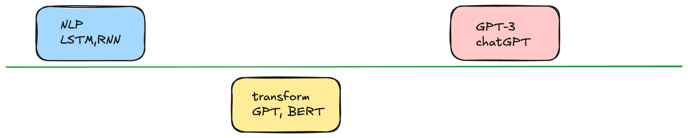
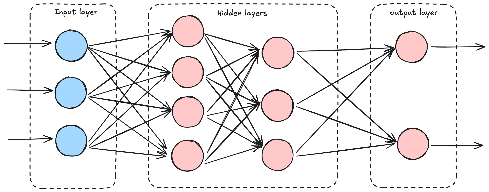
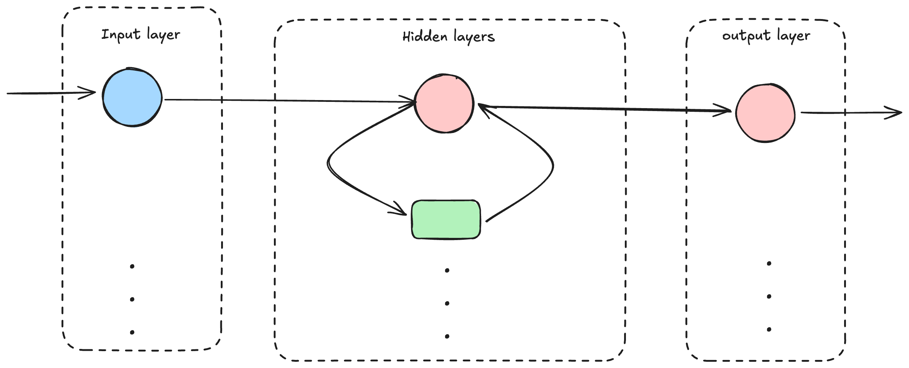
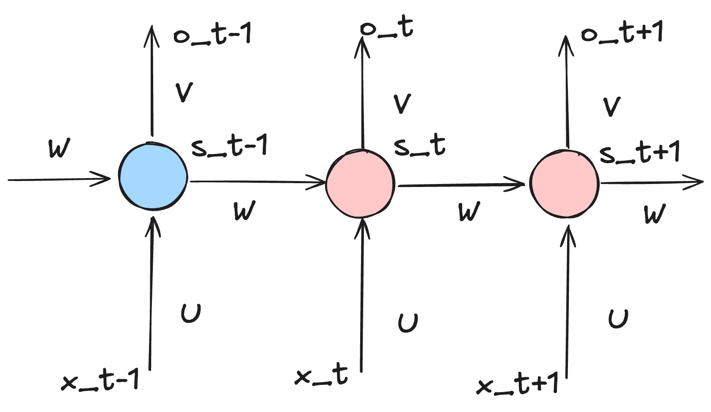
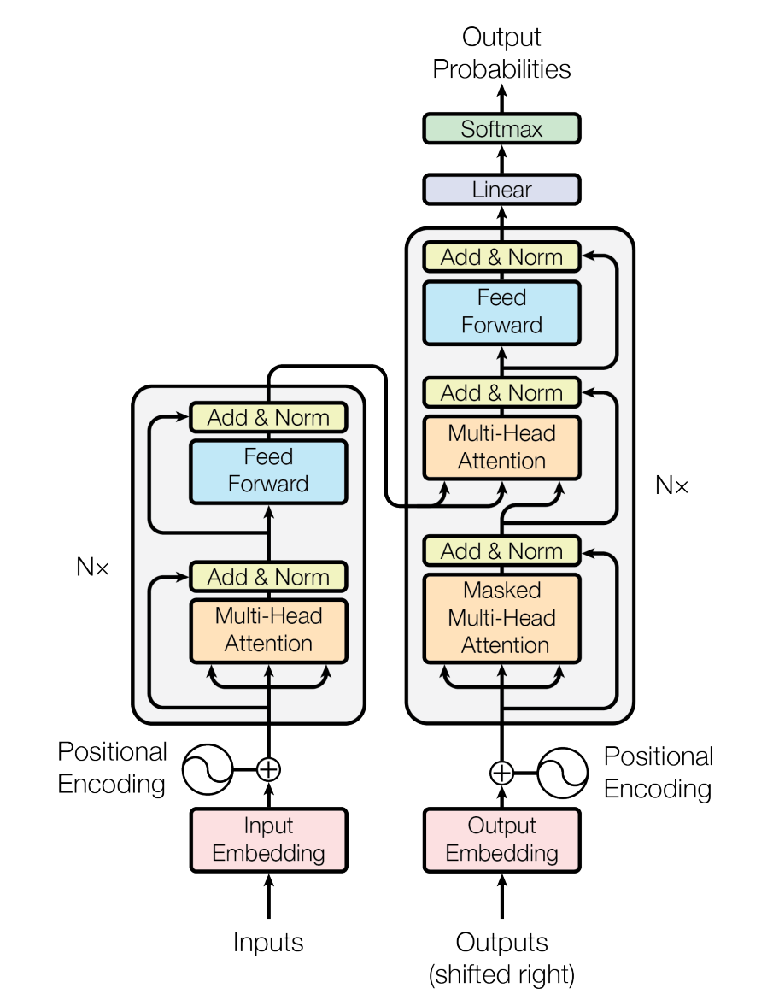

# llm intro

<!--more-->
## 简介

### NN 

神经网络
- 可以拟合任意函数
- 拟合过程黑盒
- 前后输入完全无关

### RNN

循环神经网络
- 一般处理序列信息，前后输入相关

$$O_t= g(V \cdot S_t) $$
$$S_t = f(U\cdot X_t + W\cdot S_{t-1})$$

## Transformer网络

- 用于序列建模的深度神经网络结构
- 采用全局注意力机制
- 更好捕捉序列中不同位置之间的关系
- 并行计算优势明显

### 输入

- 单词Embedding + 位置Embedding (Positional Encoding) 相加得到

#### Embedding
Embedding 是一种映射，将现实中的 文字、图片等信息转化为计算机能识别的语言  
举例 地图类比 现实地理的embedding

对比one-hot编码
one-hot编码：过于稀疏，过度占用资源

Embedding 的作用 
- 降维 利用矩阵乘法进行降维
- 升维 对低维的数据进行升维时，可能把一些其他特征给放大了，或者把笼统的特征给分开了

语义中通过计算获得单词之间的关系，可以推算出更多单词之间的关系

#### 单词Embedding

- 获取方式：Word2Vec、Glove 等算法预训练得到，也可以在 Transformer 中训练得到

#### 位置Embedding

- Transformer 使用全局信息，不能利用单词的顺序信息
- Transformer 中使用位置Embedding 保存单词在序列中的相对或绝对位置

位置Embedding 计算公式

$$PE_{(pos, 2i)} = \sin (pos/10000^{2i/d})$$
$$PE_{(pos, 2i+1)} = \cos (pos/10000^{2i/d})$$

PE: 位置Embedding  
d: PE 维度  
2i:表示偶数维度  
2i+1 表示奇数维度  
pos 单词在句子中的位置 

通过正余弦公式，
$$\sin (A+B) = \sin A \cos B + \cos A\sin B$$
$$\cos (A+B) = \cos A \cos B - \sin A\sin B$$

$$PE_{pos}$$可以很快算出 $$PE_{pos+k}$$ 

- 将单词的词 Embedding 和位置 Embedding 相加， 就是 Transformer 的输入

#### Attention 注意力机制
下意识的动作 被称为 不随意线索(不随着意识的线索)
自己主观的动作是随意线索

- 注意力机制则显式地考虑随意线索
  - 随意线索称之为查询(query) 类比现实世界中我想要做的动作
  - 每个输入是一个值(value) 和不随意线索(key) 对， 类比现实世界中的环境
  - 通过注意力池化层来有偏向性地选择某些输入

我们可以用在图书馆找书的场景来类比注意力机制中的 query、key 和 value。  
Query（查询）：  
假设你现在有一个特定的研究主题，比如 “人工智能在医疗领域的应用”。这个研究主题就是 query，代表着你的特定需求和关注点。你带着这个问题来到图书馆，希望找到与之相关的书籍和资料。  
Key（键）：  
图书馆里的每一本书都可以看作一个信息单元。每本书的书名、目录、关键词等就像是 key。这些 key 可以帮助你快速判断这本书是否与你的查询需求相关。例如，一本书的书名是《人工智能医疗创新》，这个书名就是一个 key，它与你的 query 有较高的相关性。  
Value（值）：  
书的具体内容就是 value。当你通过书名等 key 判断一本书可能与你的 query 相关后，你会进一步查看这本书的具体内容，也就是 value。如果这本书的内容详细介绍了人工智能在医疗领域的各种应用案例、技术原理等，那么这些内容就是你所需要的 value。  

在这个场景中，你首先根据 query（研究主题）去扫描图书馆里的各种 key（书名、关键词等），找到可能相关的书籍。然后，通过查看这些书籍的 value（具体内容），来获取与你的查询需求最相关的信息。这就类似于注意力机制中，通过 query 与 key 的匹配，提取出相应的 value，从而聚焦在最相关的信息上。  

#### Self-attention （自注意力机制）

---

> 作者: toxi  
> URL: https://example.com/llm-intro/  

