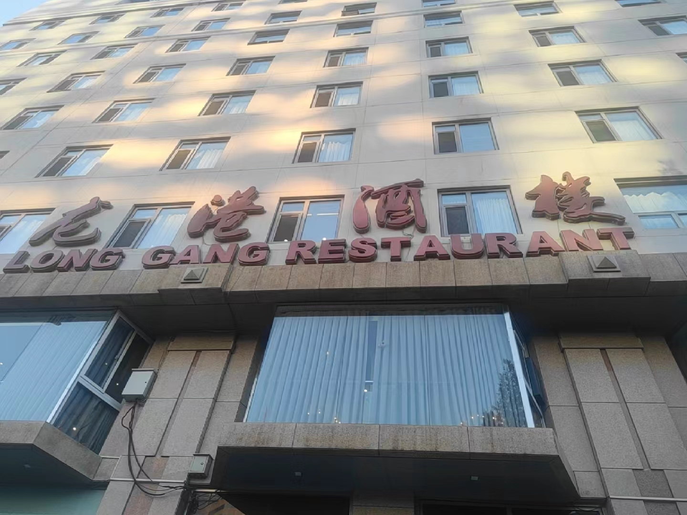
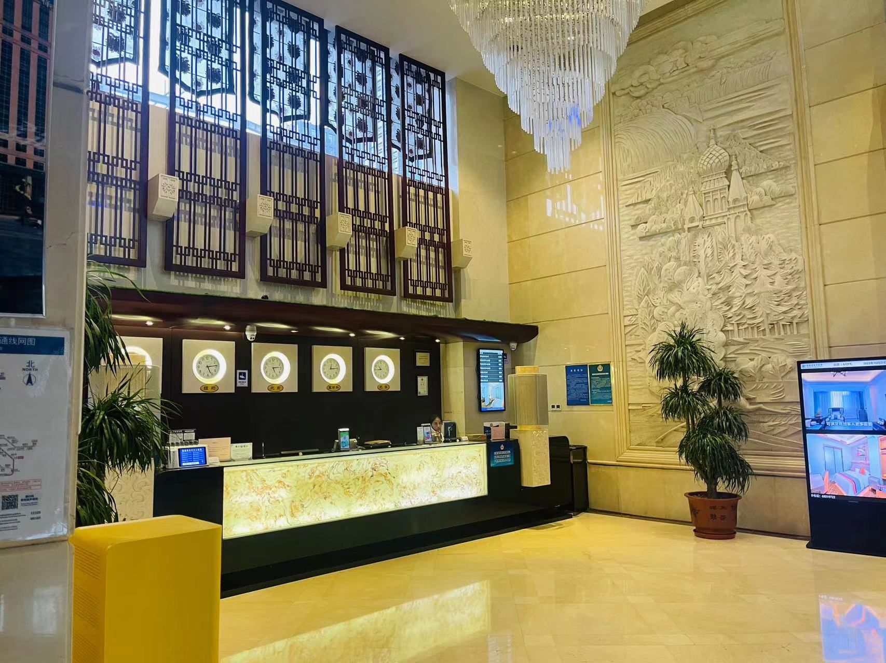
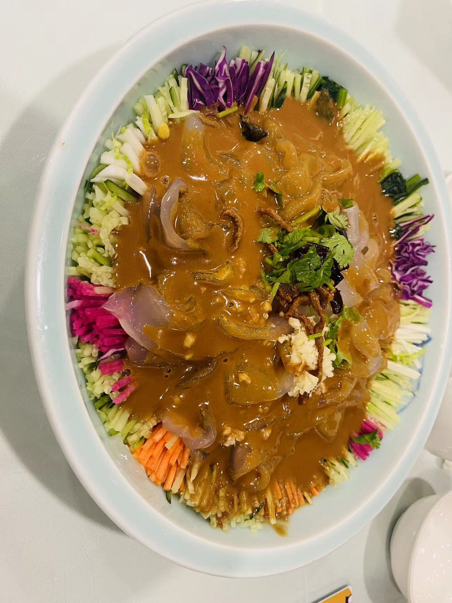
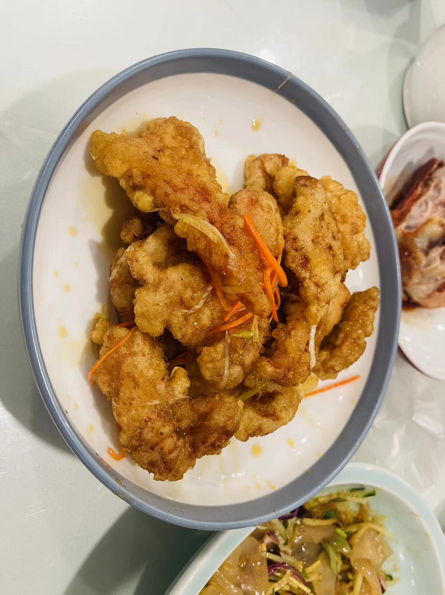
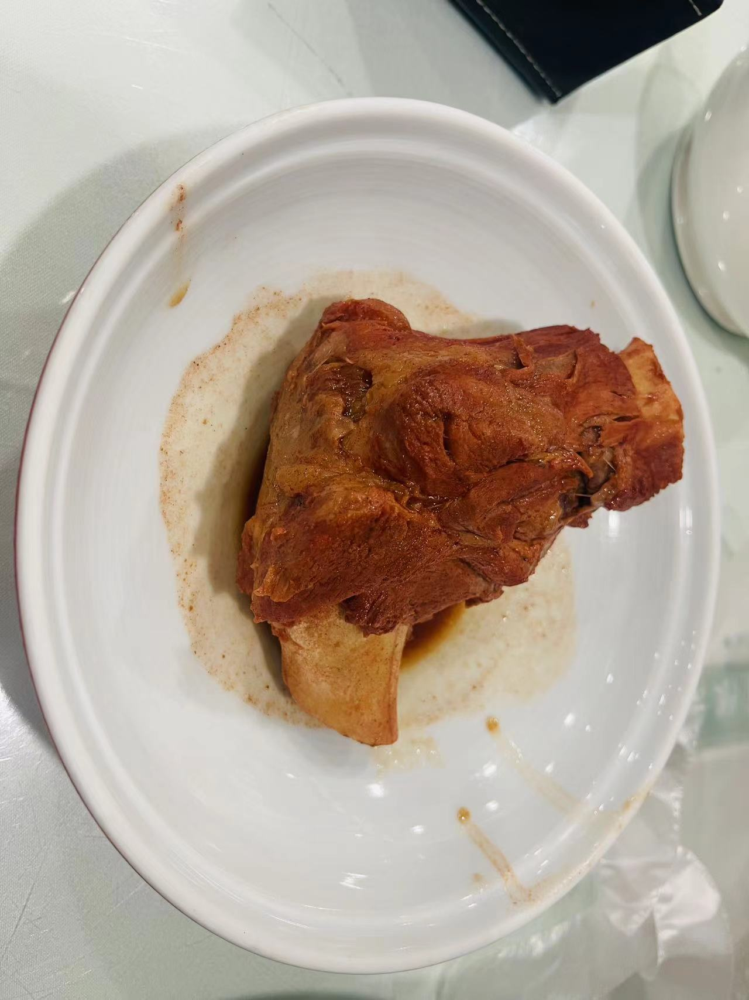
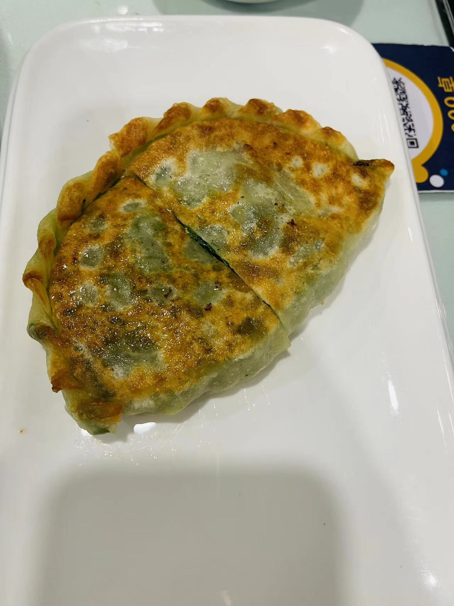

# 龙港酒楼

<!--more-->

发现美女一枚~

## 记录
| 时间                   | 地址                         | 人数 | 排队等待 | 花销 |
| ---------------------- | ---------------------------- | ---- | -------- | ---- |
| 2023年10月22日17:50:00 | 北京市西城区复兴门外北大街5号 | 2    | 无需排队   | 235  |

## 一句话
虽然不在东北，还是低估了东北菜的分量

## 点餐
### 凉菜

东北大拉皮：五彩斑斓，拉皮晶莹剔透，柔软富有弹性；量大管饱，酸甜可口，配菜黄瓜胡萝卜紫甘蓝都很脆，爽口   

### 热菜

传统锅包肉：外酥里嫩，酸甜口的锅包肉吃起来一点也不腻，好吃，这一盘子2个人全都吃干净了    

BB豆：忘了叫啥名字了，就记住最后的BB豆 :joy:，上来了一锅土豆也是惊呆了我们；口味终于不是酸甜口的，属于咸香口的土豆，太多了，吃到一半有点撑了  

大棒骨：

大棒骨：大棒骨味道还可以，和卤肉店买的酱香棒骨还是有一些区别，没有卤肉店那么咸  

### 主食

韭菜盒子：韭菜盒真的可以，就喜欢这口，本来已经吃饱了，结果上来之后还是想吃，吃不够又点了一个

## 总结

东北菜还是实惠一些，锅包肉酸甜不腻，韭菜盒子非常推荐~

## 附录
[北京吃喝篇](/life-in-beijing/#吃喝篇)

---

> 作者: utopiacraft  
> URL: https://example.com/longgangjiulou/  

