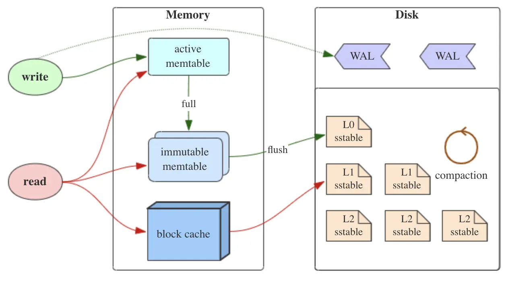
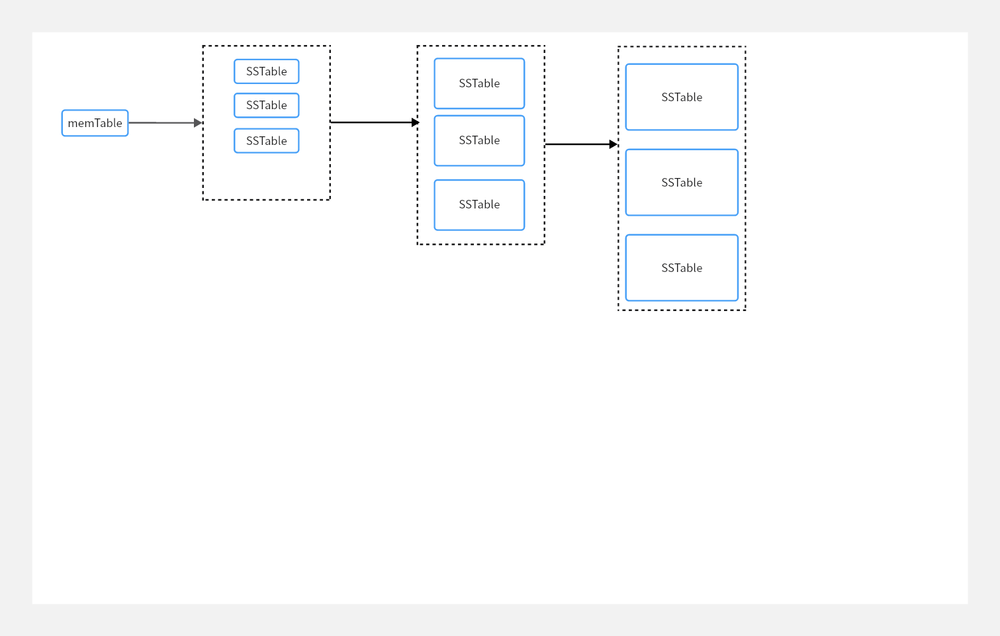
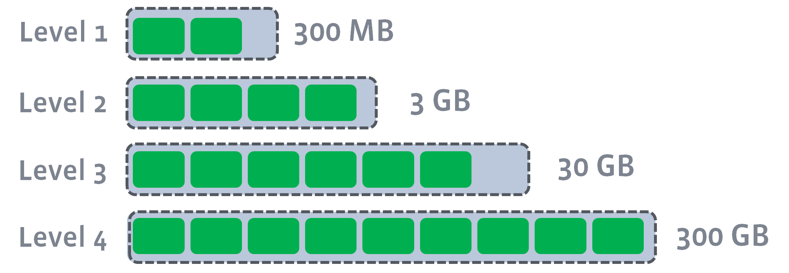
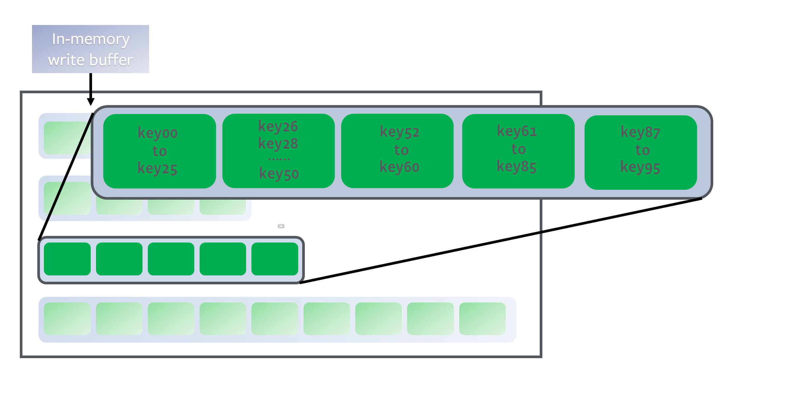
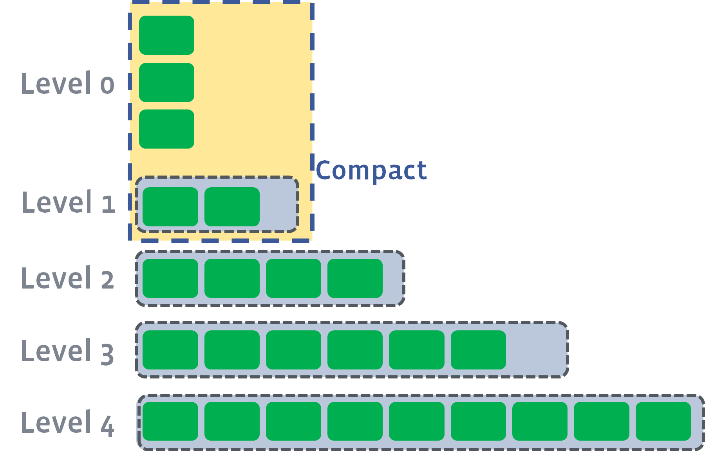
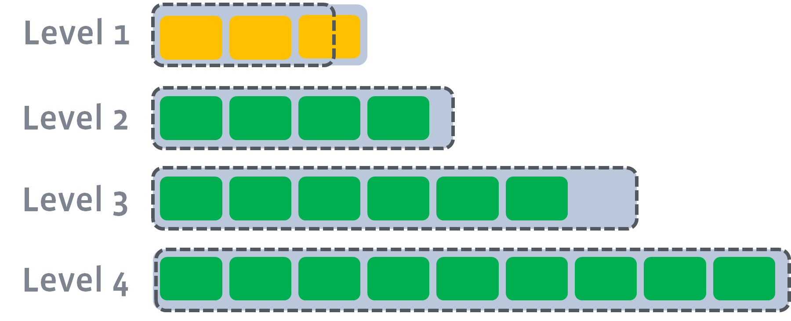
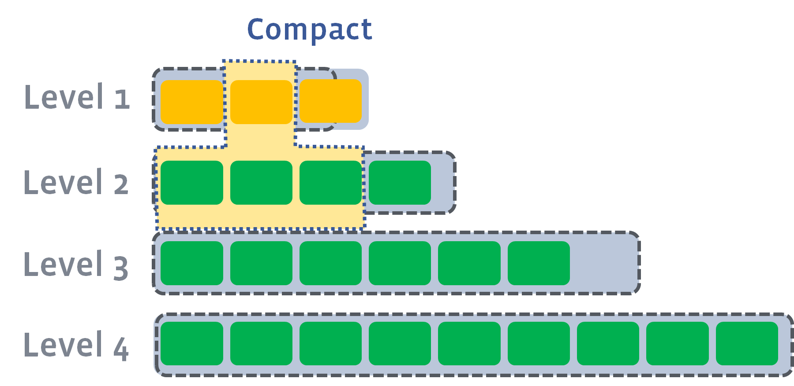
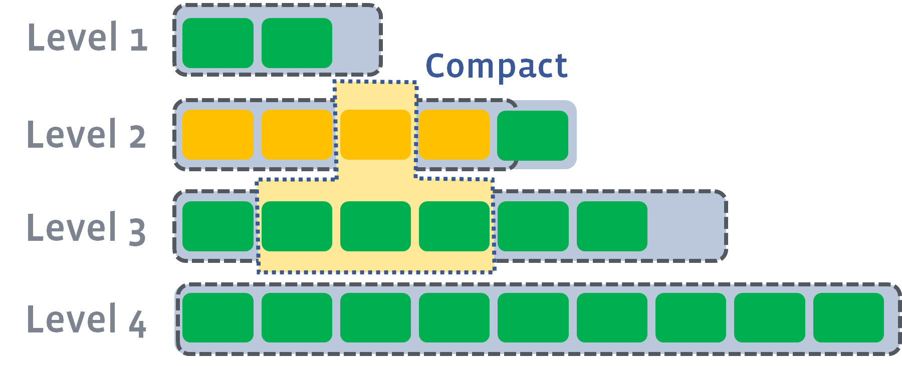
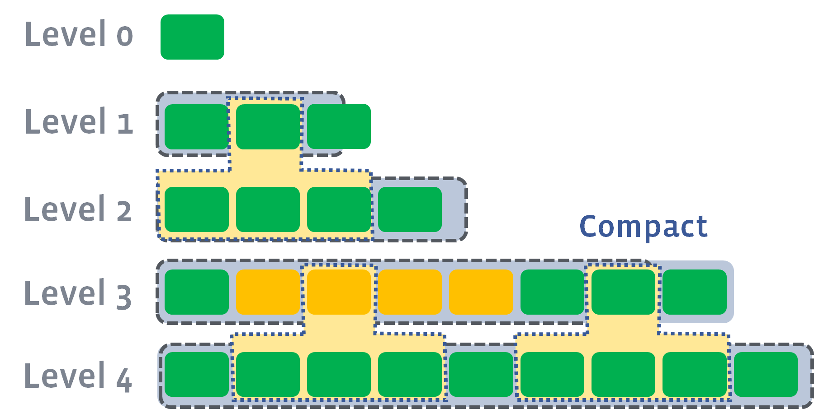
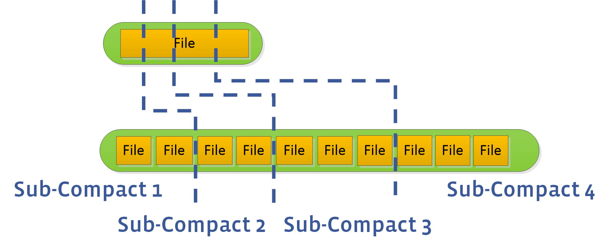

# LSM树

## LSM 树(Log-Structured-Merge-Tree)

- 不算是树，其实是一种存储结构
- 利用顺序追加写来提高写性能
- 内存-文件读取方式会降低读性能

### MemTable

- 放置在内存里
- 最新的数据
- 按照Key 组织数据有序(HBase：使用跳表)
- WAL保证可靠性

### Immutable MemTable

- MemTable 达到一定大小后转化成Immutable MemTable
- 写操作由新的MemTable 处理， 在转存过程中不阻塞数据更新操作

### SSTable(Sorted String Table)

- 有序键值对集合
- 在磁盘的数据结构
- 为了加快读取SSTable的读取，可以通过建立key索引以及布隆过滤器来加快key的查找

- LSM树会将所有的数据插入、修改、删除等操作记录保存在内存中；当此类操作达到一定的数据量后，再批量地顺序写入到磁盘当中
- LSM树的数据更新是日志式的，当一条数据更新会直接append一条更新记录完成的，目的就是为了顺序写，将Immutable MemTable flush到持久化存储，而不用修改之前的SSTable中的key
- 不同的SSTable中，可能存在相同Key的记录，最新的记录是准确的（索引/Bloom来优化查找速度）
- 为了去除冗余的key需要进行compactcao操作

## Compact策略

### 顺序冗余存储可能带来的问题

- 读放大
读取数据时实际读取的数据量大于真正的数据量
Eg: 先在 MemTable 查看当前Key 是否存在，不存在继续从SSTable中查找
- 写放大
写入数据时实际写入的数据量大于真正的数据量
Eg: 写入时可能触发Compact操作，导致实际写入的数据量远大于该key的数据量
- 空间放大
数据实际占用的磁盘空间比数据的真正大小更多
Eg: 对于一个key来说，只有最新的那条记录是有效的，而之前的记录都是可以被清理回收的。

### Compact策略

#### size-tiered 策略

- 保证每层内部的SSTable的大小相近
- 同时限制每一层SSTable的数量
- 每层限制SSTable为N，当每层SSTable达到N后，则触发Compact操作合并这些SSTable，并将合并后的结果写入到下一层成为一个更大的sstable。

当层数达到一定数量时，最底层的单个SSTable的大小会变得非常大。并且size-tiered策略会导致空间放大比较严重。即使对于同一层的SSTable，每个key的记录是可能存在多份的，只有当该层的SSTable执行compact操作才会消除这些key的冗余记录。

#### leveled策略

leveled策略也是采用分层的思想，每一层限制总文件的大小

- 将每一层切分成多个大小相近的SSTable
- 这一层的SSTable是全局有序的，意味着一个key在每一层至多只有1条记录，不存在冗余记录

##### 合并过程

1. L1的总大小超过L1本身大小限制：

2. 此时会从L1中选择至少一个文件，然后把它跟L2有交集的部分(非常关键)进行合并。生成的文件会放在L2:

此时L1第二SSTable的key的范围覆盖了L2中前三个SSTable，那么就需要将L1中第二个SSTable与L2中前三个SSTable执行Compact操作。
3. 如果L2合并后的结果仍旧超出L5的阈值大小，需要重复之前的操作 —— 选至少一个文件然后把它合并到下一层

Ps: 多个不相干的合并是可以并发进行的：

leveled策略相较于size-tiered策略来说，每层内key是不会重复的，即使是最坏的情况，除开最底层外，其余层都是重复key，按照相邻层大小比例为10来算，冗余占比也很小。因此空间放大问题得到缓解。但是写放大问题会更加突出。举一个最坏场景，如果LevelN层某个SSTable的key的范围跨度非常大，覆盖了LevelN+1层所有key的范围，那么进行Compact时将涉及LevelN+1层的全部数据

