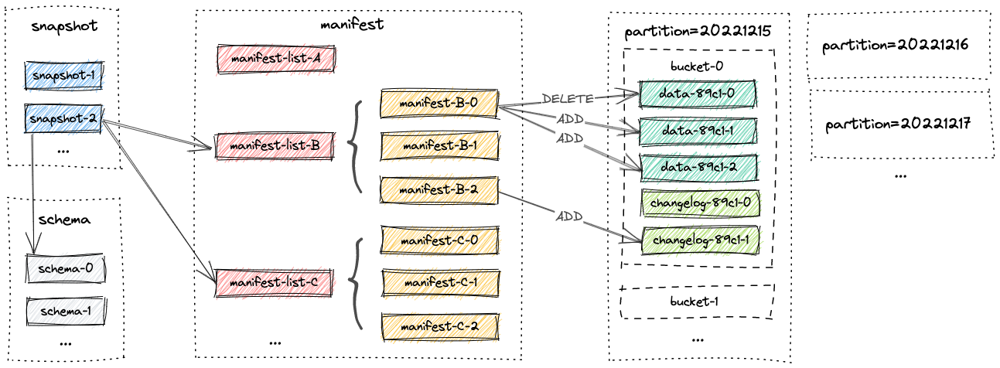
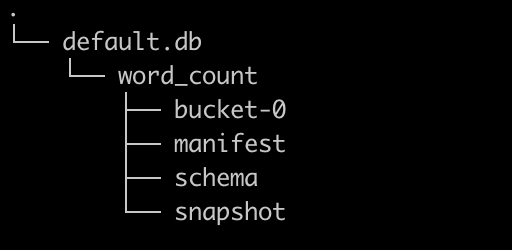

# Paimon


<!--more-->

## 简介

- Paimon 是一个流数据湖平台


### 数据入湖

1. 实时集成
2. 数据库整库同步
3. schema变更同步（表结构变更）
4. 部分列更新
5. 批量覆盖

### 支持

1. 增量快照
2. 产生changelog
3. lookup join
4. batch/OLAP 查询

### 核心特性

1. 统一批处理和流处理
   1. 批量写入和读取，流式更新，变更日志生成
2. 数据湖能力
   1. 低成本、高可靠性、可扩展的元数据
3. 各种合并引擎
   1. 按照要求更新记录
4. 变更日志生成
5. 多种表类型
6. schema 变更
   1. 重命名列

#### 一致性保证

- 使用两阶段提交
- 每次提交在提交时最多生成2个快照
- 桶是读写的最小单元
- 两个writer如果修改的不是同一个桶，则提交是有序的
- 如果两个writer修改同一个桶，保证快照隔离，不会丢失更改信息，可能会合并两次提交，混合起来

### 文件布局



#### 快照文件(Snapshot Files)

- 快照目录存储了所有的快照文件
- 快照文件是JSON文件
- 一个快照文件包含
  - 若干使用的schema文件
  - 快照所有更改的manifest lists

#### 清单文件(Manifest Files)

- 清单目录存储了清单列表(manifest lists)和清单文件(manifest files)
- 清单列表保存的是清单文件的文件名
- 清单文件包含 LSM数据文件和 changelog 文件的变化(例如快照中LSM数据的创建或者是文件的删除)

#### 数据文件(Data Files)

- 数据文件会进行分区和分桶
- 一个分区下面会有多个分桶(目录)
- 一个分桶里包含LSM数据 以及 changelog
- 默认使用orc文件，支持parquet,avro

#### LSM Trees

- paimon 的数据是由LSM Tree 进行组织的

##### Sorted Runs

- LSM Tree 将文件组织成若干个 Sorted Runs
- 一个 sorted run 包含一个或多个数据文件，每个数据文件只属于一个sorted run
- 数据文件中的记录按照主键排序
- 同一个 sorted run 中，数据文件的主键范围不会重叠
- 不同的 sorted run 中，数据文件的主键范围是有可能重叠的，因此在查询LSM Tree 的时候，需要合并所有的 sorted runs 中相同主键的记录，按照用户指定的合并引擎 和时间戳
- LSM Tree 的新纪录会先写入内存，内存缓冲区满了之后会刷新到磁盘，创建新的sorted run


##### Compaction

- 越来越多的记录写入LSM Tree 后，sorted run 就会增多
- 查询LSM Tree时需要将所有的 sorted run 都合并起来，过多的sorted run 就会导致查询性能下降，或者OOM
- 将多个sorted run 合并成一个大的 sorted run 的这个过程被称之为 Compaction
- 过于频繁的 Compaction也会消耗一定的cpu和磁盘io， paimon 使用与rocksdb类似的通用压缩 Compaction策略
- 可以指定 专用compaction作业(dedicated compaction job) 进行 compaction

## catalog 文件系统

paimon catalog 可以持久化元数据
支持两种metastore
- 文件系统，file HDFS 等
- Hive,使用 hive metastore 存放元数据

```sql
CREATE CATALOG my_hive WITH (
  'type' = 'paimon',
  'metastore' = 'hive',
  'uri' = 'thrift://<hive-metastore-host-name>:<port>',
  -- 'hive-conf-dir' = '...', this is recommended in the kerberos environment
  'warehouse' = 'hdfs:///path/to/table/store/warehouse'
);
```

## 上手

目前 paimon 提供了两个的jar包
- boudled jar 用于 读写数据，也就是启动flink任务，with 参数等
- action jar 用于 各种操作，如手动compaction等， 这个可以在任务之外进行操作

```sql
-- if you're trying out Paimon in a distributed environment,
-- the warehouse path should be set to a shared file system, such as HDFS or OSS
CREATE CATALOG my_catalog WITH (
    'type'='paimon',
    'warehouse'='file:/tmp/paimon'
);

USE CATALOG my_catalog;

-- create a word count table
CREATE TABLE word_count (
    word STRING PRIMARY KEY NOT ENFORCED,
    cnt BIGINT
);

-- create a word data generator table
CREATE TEMPORARY TABLE word_table (
    word STRING
) WITH (
    'connector' = 'datagen',
    'fields.word.length' = '1'
);

-- paimon requires checkpoint interval in streaming mode
SET 'execution.checkpointing.interval' = '10 s';

-- write streaming data to dynamic table
INSERT INTO word_count SELECT word, COUNT(*) FROM word_table GROUP BY word;


```

使用paimon后，该目录如下



### default.db 
default.db 为默认的数据库，就是catalog下的数据库目录

### word_count 

word_cound 是在数据库下创建的表目录

### bucket-0
bucket-x 就是 真正存储数据的地方，数据多了之后还会有 bucket-1 bucket-2 等
是一系列orc 后缀的文件

### schema
schema 也是json 文件，而且会有多个,主要也是为了保存变更的schema

```json
{
  "id" : 0,
  "fields" : [ {
    "id" : 0,
    "name" : "word",
    "type" : "STRING NOT NULL"
  }, {
    "id" : 1,
    "name" : "cnt",
    "type" : "BIGINT"
  } ],
  "highestFieldId" : 1,
  "partitionKeys" : [ ],
  "primaryKeys" : [ "word" ],
  "options" : { }
}
```
### snapshot

快照目录保存了很多的文件id，通过这些id 可以更快找到 清单文件和schema

```json
{
  "version" : 3,
  "id" : 15,
  "schemaId" : 0,
  "baseManifestList" : "manifest-list-f8c8e502-67ed-4b4f-9d57-bd1ff93943e6-28",
  "deltaManifestList" : "manifest-list-f8c8e502-67ed-4b4f-9d57-bd1ff93943e6-29",
  "changelogManifestList" : null,
  "commitUser" : "a196f82d-68d9-416b-a941-3b478cb0ff9b",
  "commitIdentifier" : 13,
  "commitKind" : "APPEND",
  "timeMillis" : 1692273479392,
  "logOffsets" : { },
  "totalRecordCount" : 400,
  "deltaRecordCount" : 16,
  "changelogRecordCount" : 0,
  "watermark" : -9223372036854775808
}
```
### manifest

清单目录里有很多清单文件，文件不能完全打开，但是可以看到内部是有数据文件的id等信息，应该是数据变更的信息内容

## 数据类型

- 支持了基本上所有的Flink 的数据类型，除了
  - multiset
  - map类型不支持主键


---

> 作者: toxi  
> URL: https://example.com/paimon1/  

