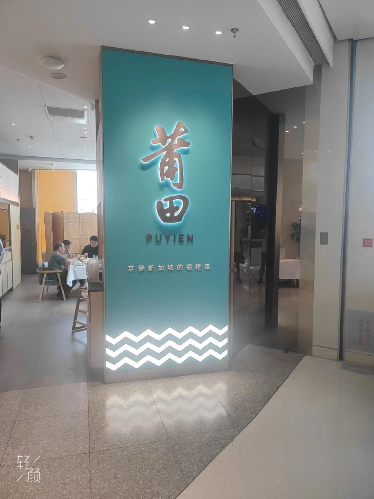
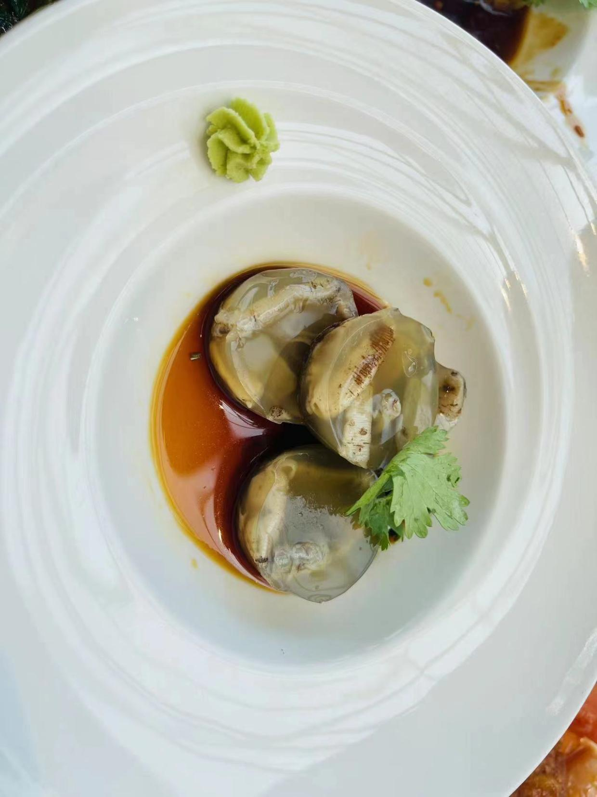
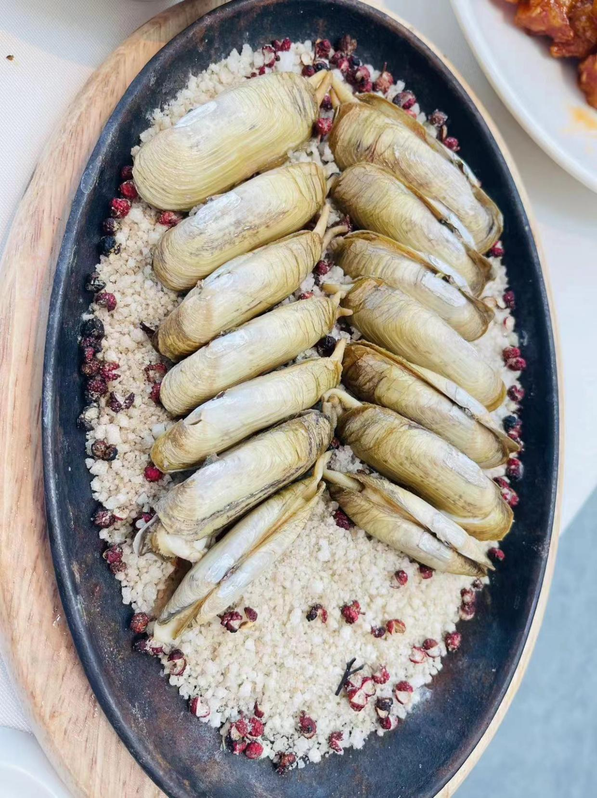
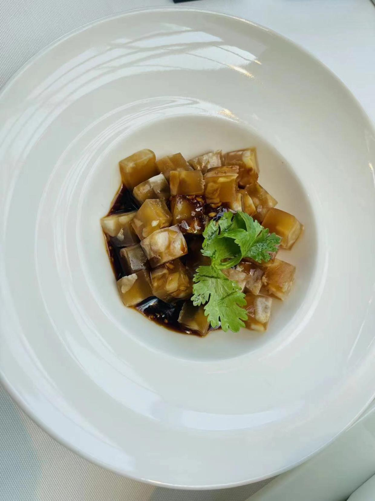
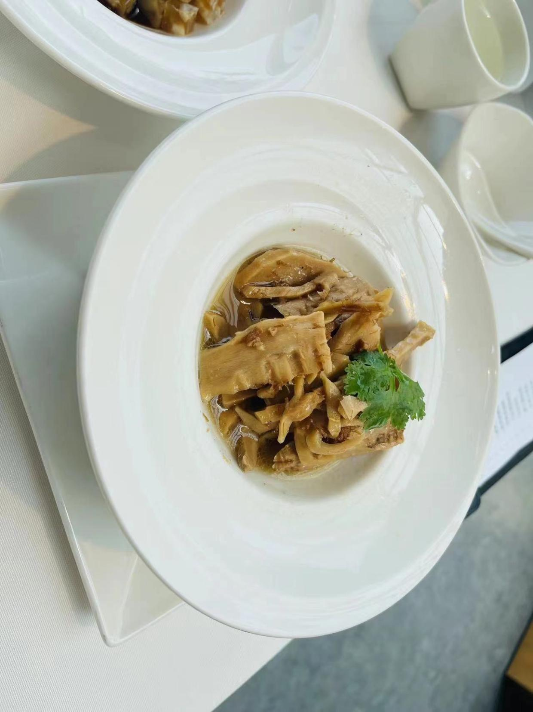
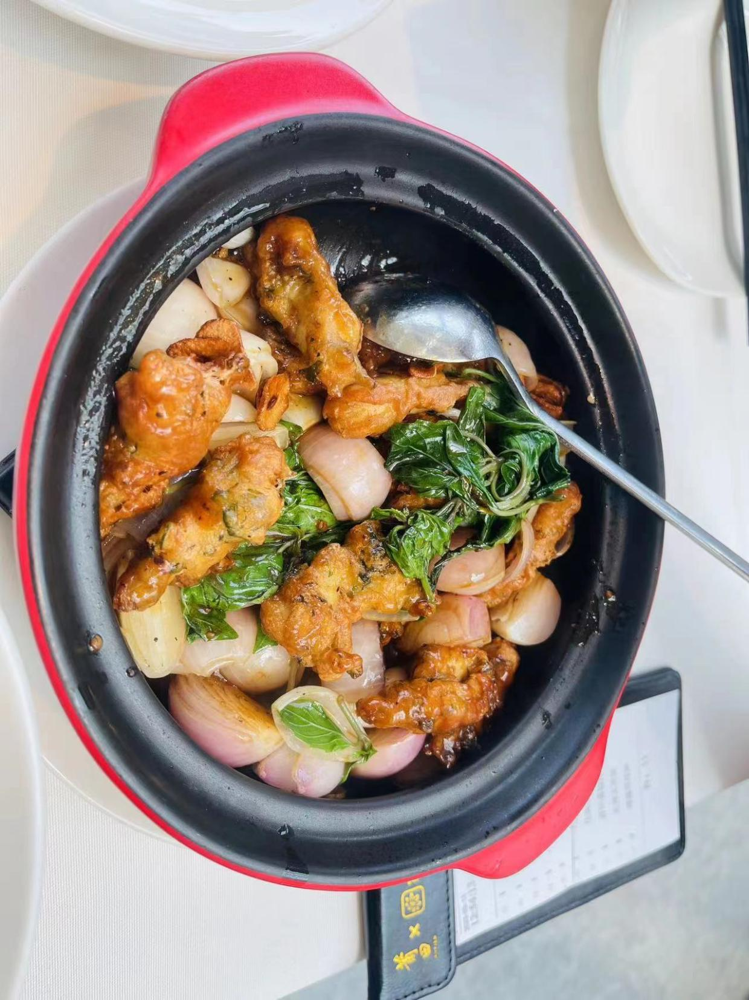
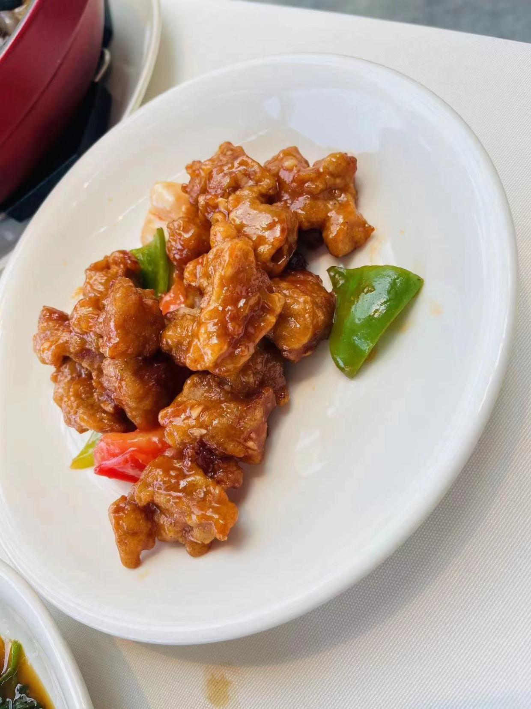
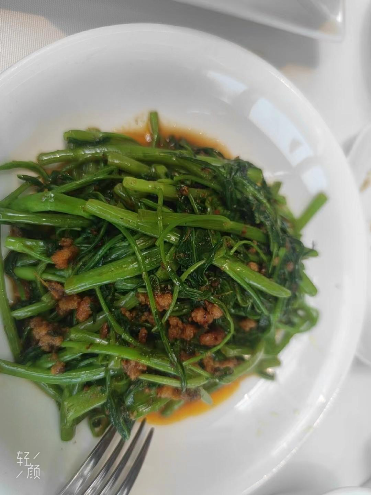
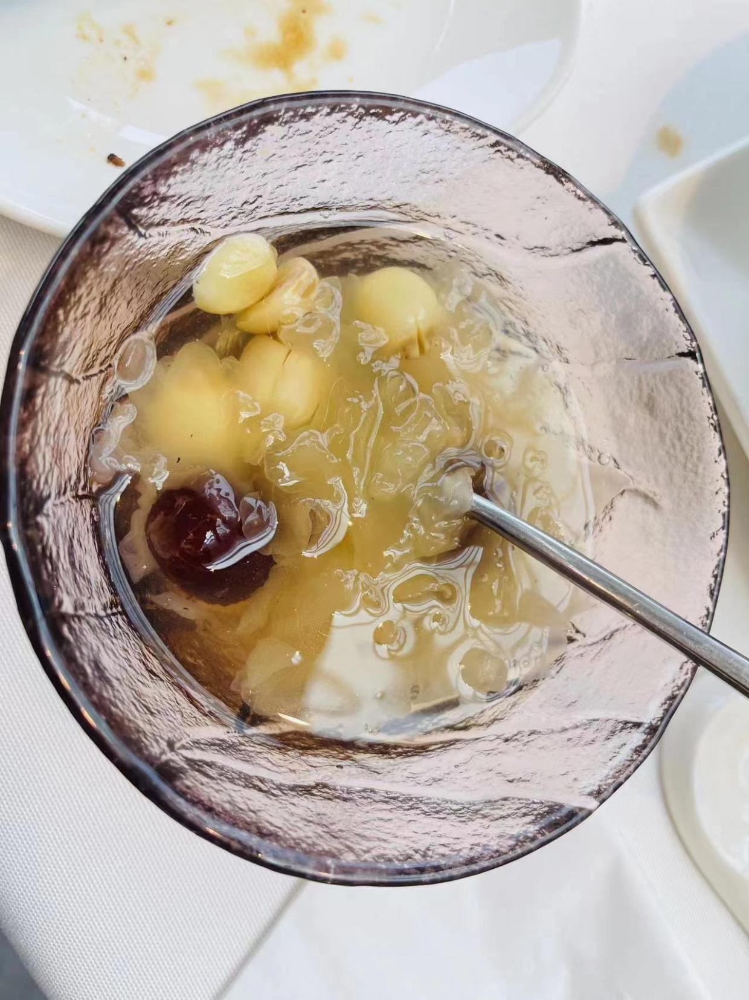

# 莆田餐厅

<!--more-->

## 记录
| 时间                   | 地址                              | 人数 | 排队等待 | 花销 |
| ---------------------- | --------------------------------- | ---- | -------- | ---- |
| 2023年05月14日12:30:00 | 海淀区清河中街66号院1号楼6层L650B | 2    | 30分钟   | 340  |

## 一句话
下次一个人跑去尝尝肉燕

## 点餐
### 凉菜

土笋冻：吃起来嘎吱嘎吱的，QQ弹弹的，啥都别想放嘴里就行啦  

### 热菜

铁板盐焗蛏：肉很肥美，蛏子刚取出来的时候还有汁水  

水晶猪蹄冻：浓稠，猪蹄冻的酱汁没吃过，很新奇  

家乡焖笋干：笋干就是笋干的味道，让我想起了我不曾去过的鱼米水乡？

九层塔海蛏煲：蛏子裹得面太厚了，鲜味被油炸和面团盖住了，尝不出肉质感  

莆田荔枝肉：荔枝很好吃  

马来风光：咸，油很大，菜上面的配料还挺鲜的  

### 甜品

建莲雪耳汤：甜，有点甜  

## 总结
作为一个北方人，对福建菜有一种好奇，吃到的东西都会觉得很新奇，有意思，可以再去尝尝别的菜  

## 附录
[北京吃喝篇](/life-in-beijing/#吃喝篇)

---

> 作者: utopiacraft  
> URL: https://example.com/putiancanting/  

