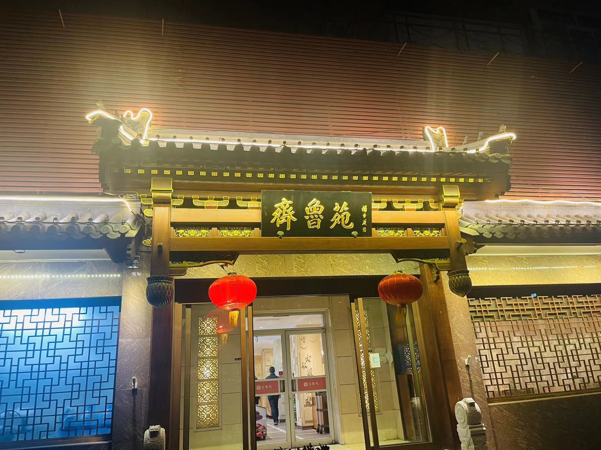
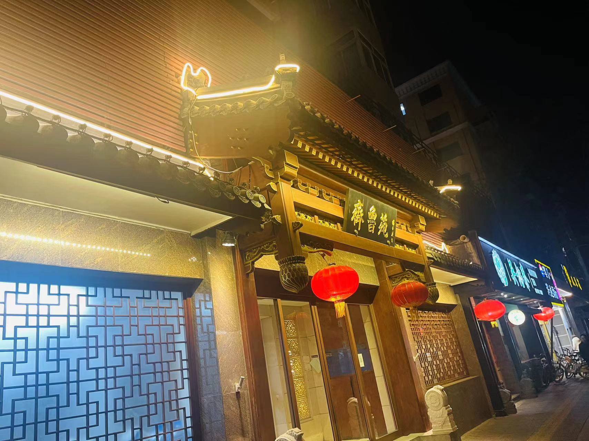
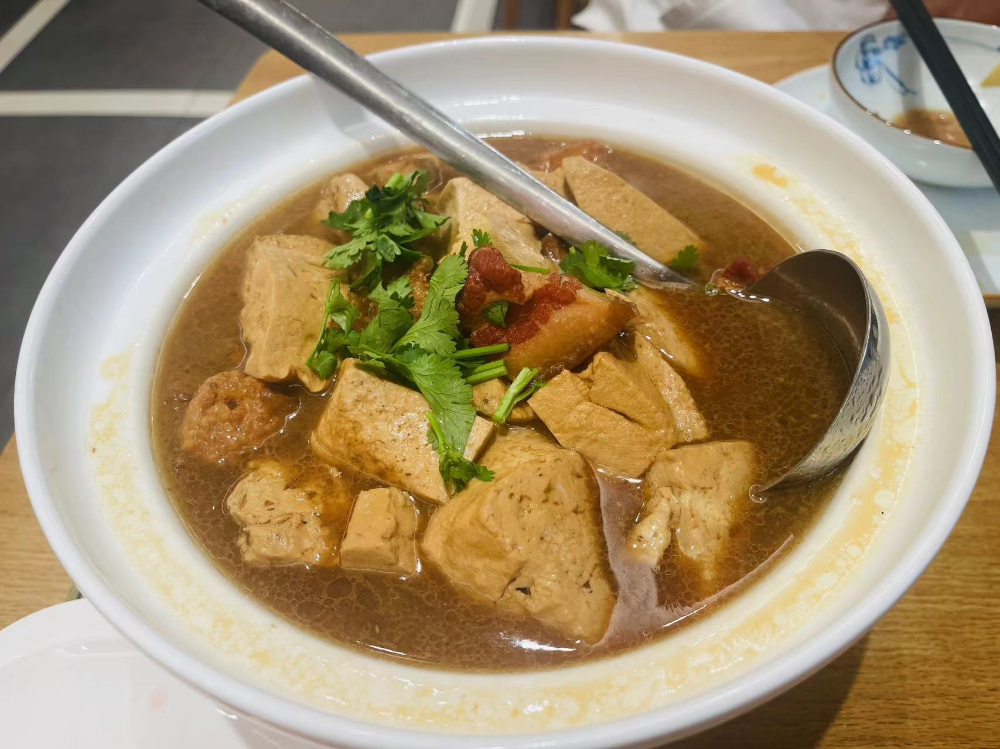
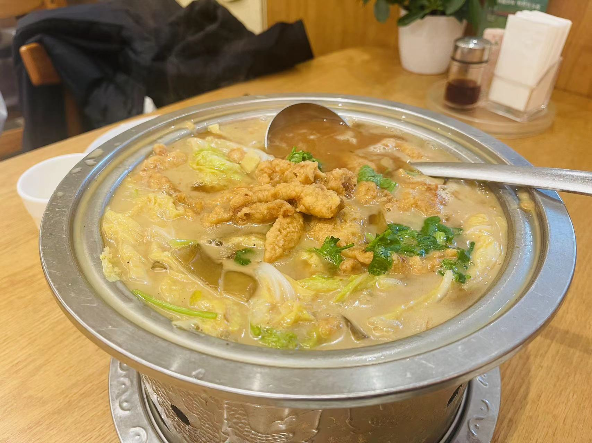
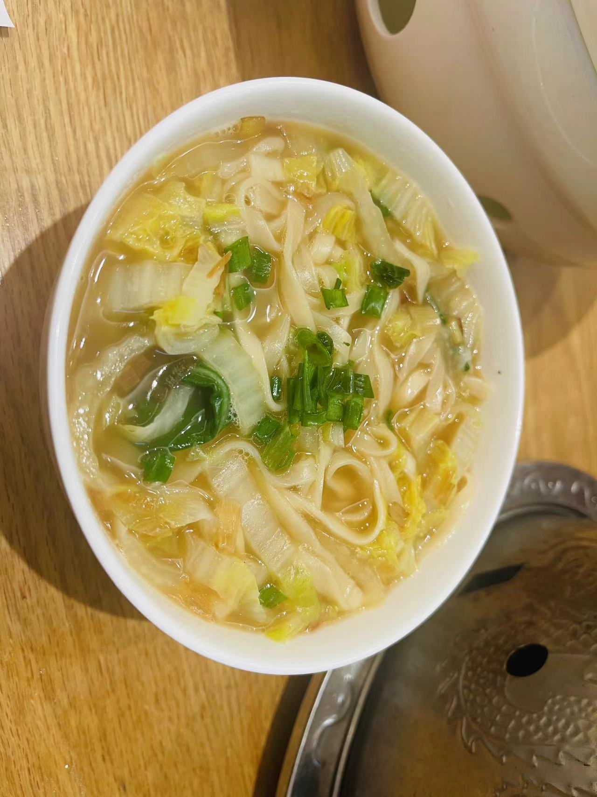
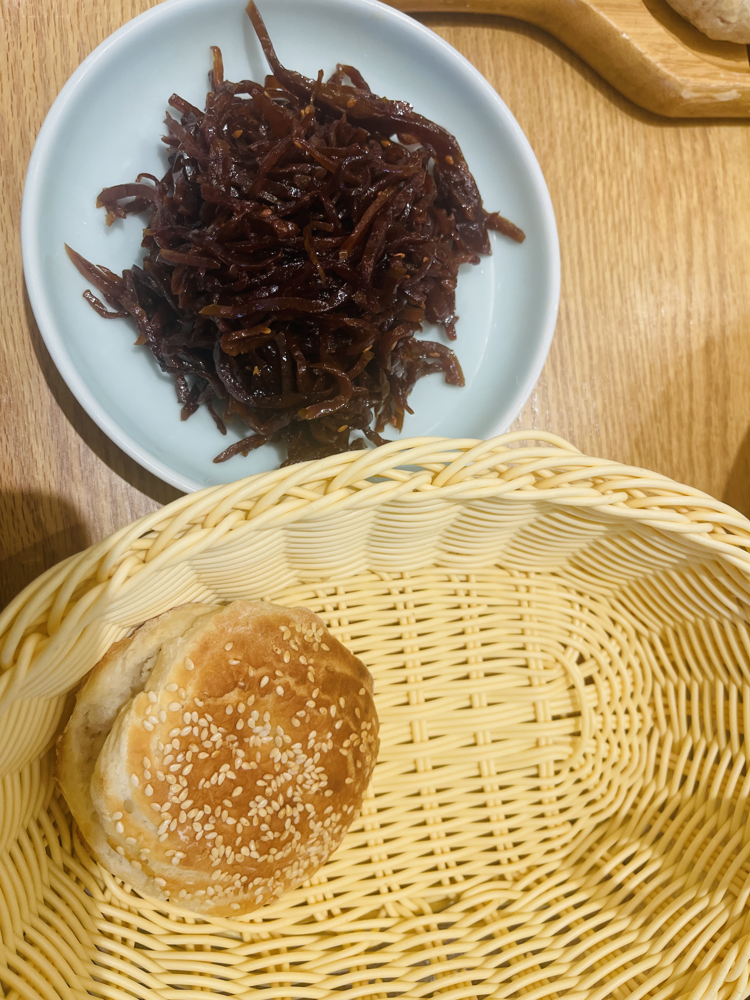
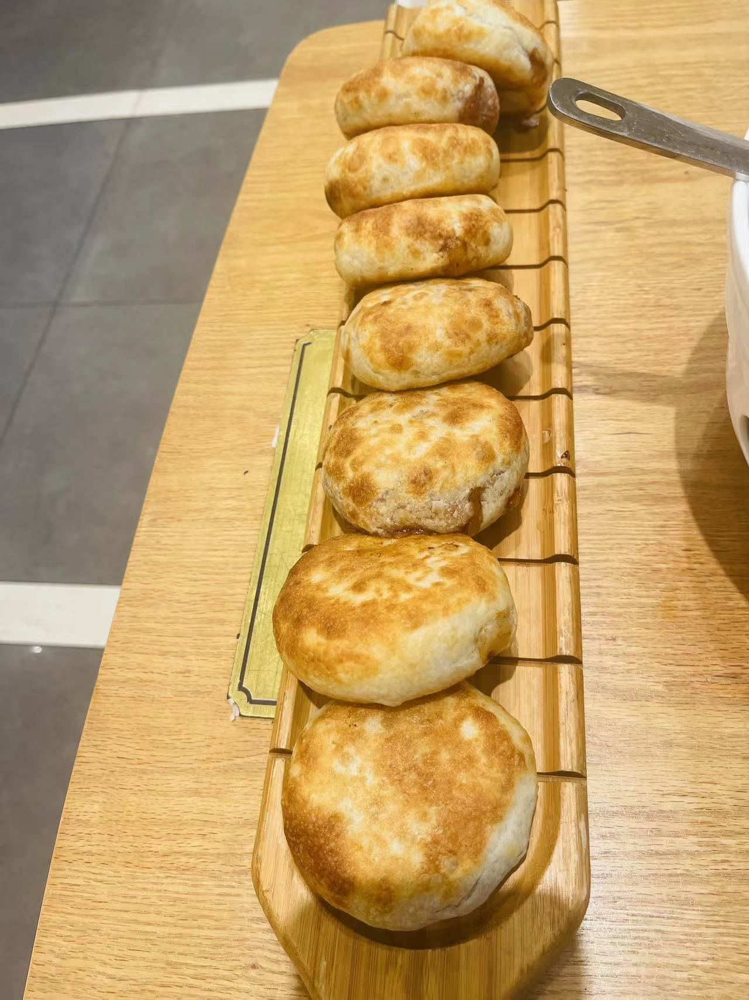
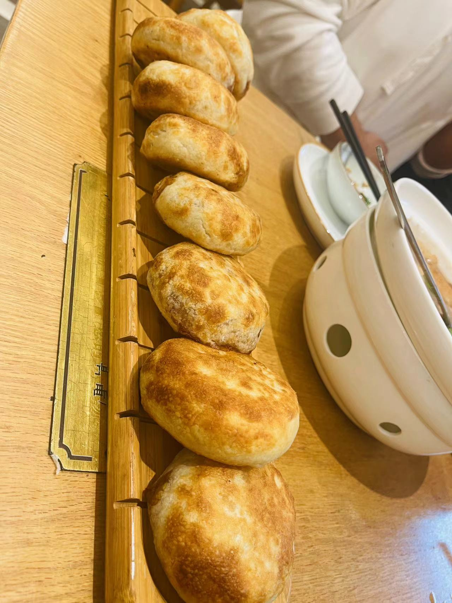

# 齐鲁苑

<!--more-->

   

emmm，这么看还挺气派的 :face_savoring_food:

## 记录
| 时间                   | 地址                                                       | 人数 | 排队等待 | 花销 |
| ---------------------- | ---------------------------------------------------------- | ---- | -------- | ---- |
| 2023年11月26日05:10:00 | 北京市海淀区马甸桥南路2号七省大院山东宾馆1楼(马甸桥西北角) | 2    | 不用排队 | 186  |

## 一句话
让我想家了，妈妈:loudly_crying_face:

## 点餐

### 热菜

- 泰安老卤豆腐：
五花肉很香，且多汁，软软烂烂的，不过吃多了还是腻腻的；豆腐很入味，心急吃不了热豆腐，心伤就吃老卤豆腐~

- 山东烩酥肉：这个口感是微酸的，喝起来还是挺开胃的，白菜，粉皮，小酥肉，让我想到家里的白菜炖粉条~

### 主食

- 特色炝锅面：一碗炝锅面恰到好处，如果再来一个西红柿，就像极了家里的热腾腾的一碗面，吃的很舒服，暖到了的漂流在外的人的心坎里

- 潘金莲咸菜：
emmm，潘金莲咸菜，不是跟武大郎烧饼很配么，建议再来个西门庆白粥，白净白净的，跟咸菜也挺配
- 武大郎烧饼：
烧饼很酥，微甜，夹上咸菜，碳水的乐趣~ 再来个二郎炝锅面吧，不吃咸菜 白粥那一套，跟烧饼是一家

- 潍坊肉火烧：
不支持单点:joy::joy::joy::joy::joy: 这个上的比较慢，这个上来后这里已经吃不下了，但还是吃了1个，肉多且有汁水，味道很正，应该是用了章丘大葱；强烈建议出小份的

## 总结
就是很舒服，感觉就像回家了一样，当然家里不会，这也是一种宾至如归吧~

## 附录
[北京吃喝篇](/life-in-beijing/#吃喝篇)

---

> 作者: utopiacraft  
> URL: https://example.com/qiluyuan/  

