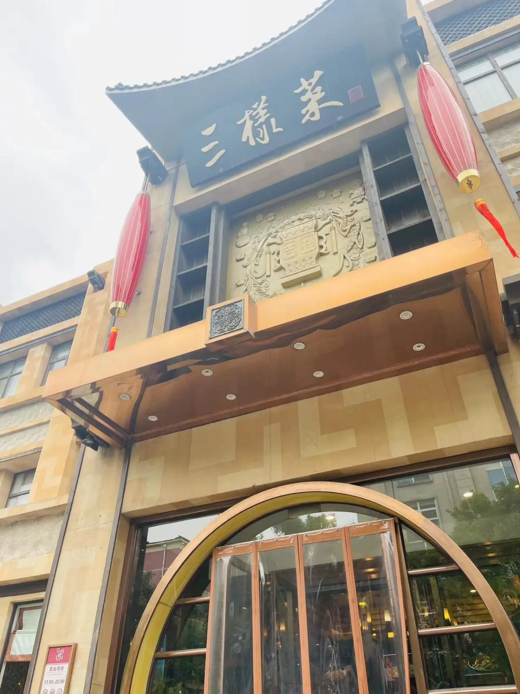
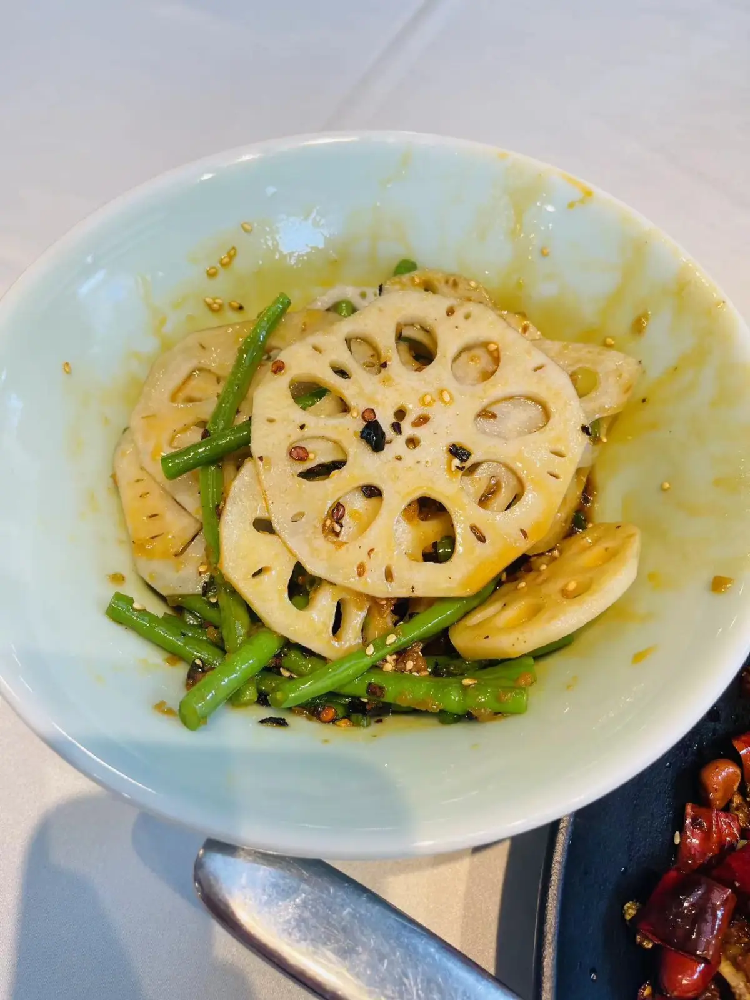
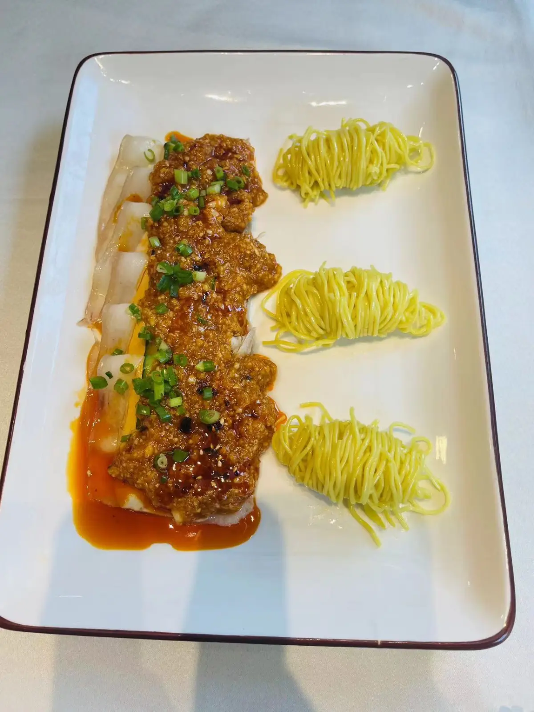
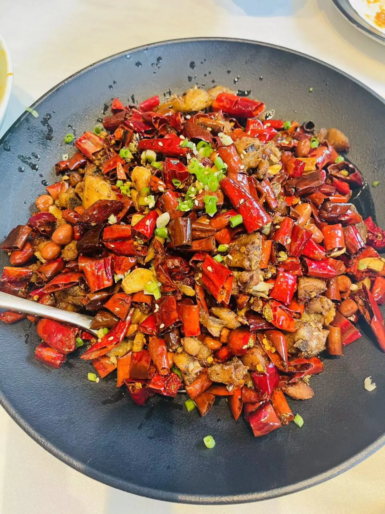
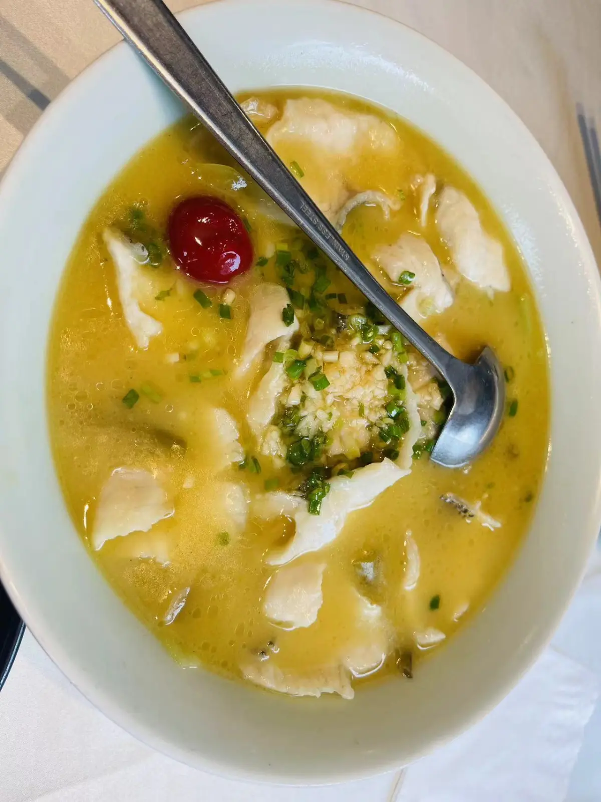

# 三样菜

<!--more-->

## 地址
北京市东城区东直门外新中街甲1号

## 时间
2023年08月06日16:12:00

## 人数
2人

## 排队等待
不用排队

## 花费
280

## 一句话
萌生了去山城走一遭的想法

## 点餐
### 凉菜

素三样：豇豆，藕，苦瓜？其实还不错

蒜蓉白肉：蒜还比较辣，真不错，一点没觉得腻

### 热菜

辣子鸡：酥脆麻辣，还有花生米，鸡肉有骨头，感觉肉有点少？

酸菜鱼：嗯，还是好吃的

### 主食

葱花饼：第一口吃下去，真不错

## 总结
个人感觉偏重庆那边的风格，够麻够辣，有机会还是要多出去看看。吃完了还是有个疑问，三样菜到底是那三样？

---

> 作者: utopiacraft  
> URL: https://example.com/sanyangcai/  

