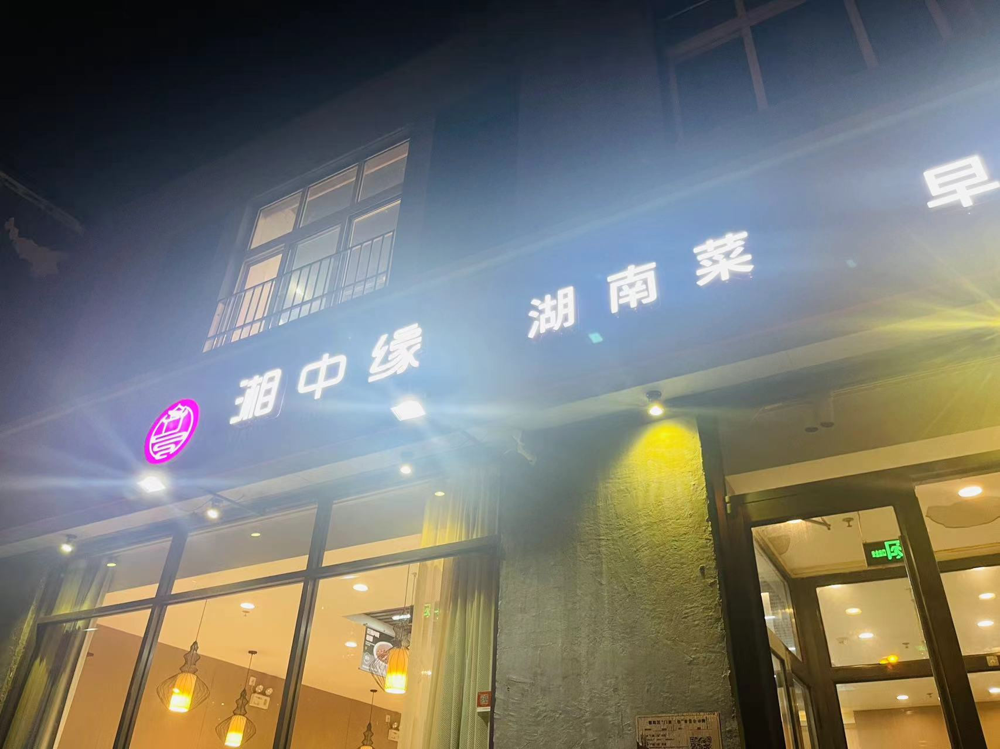
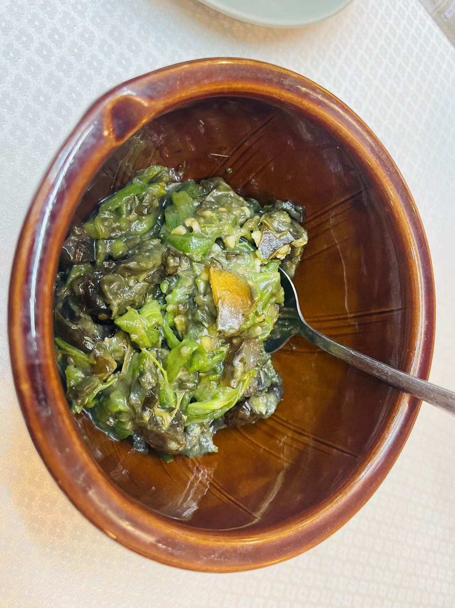
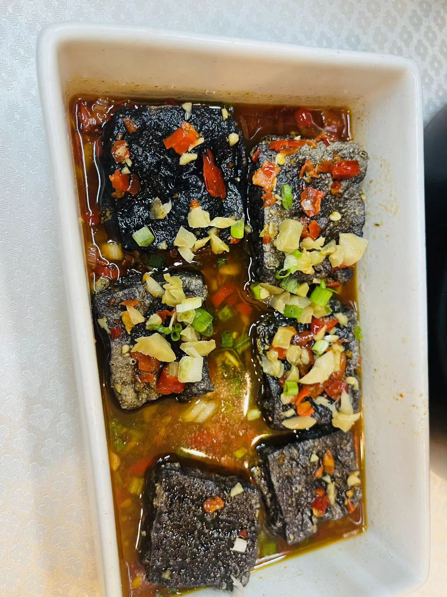
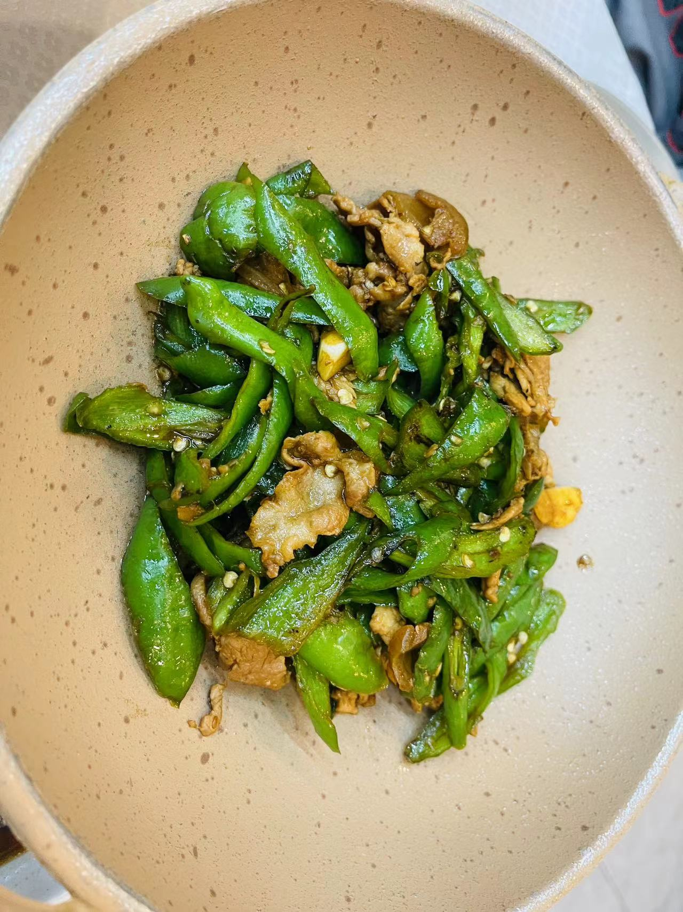
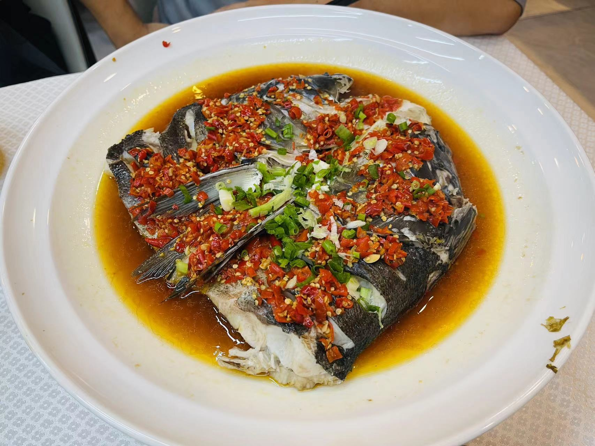
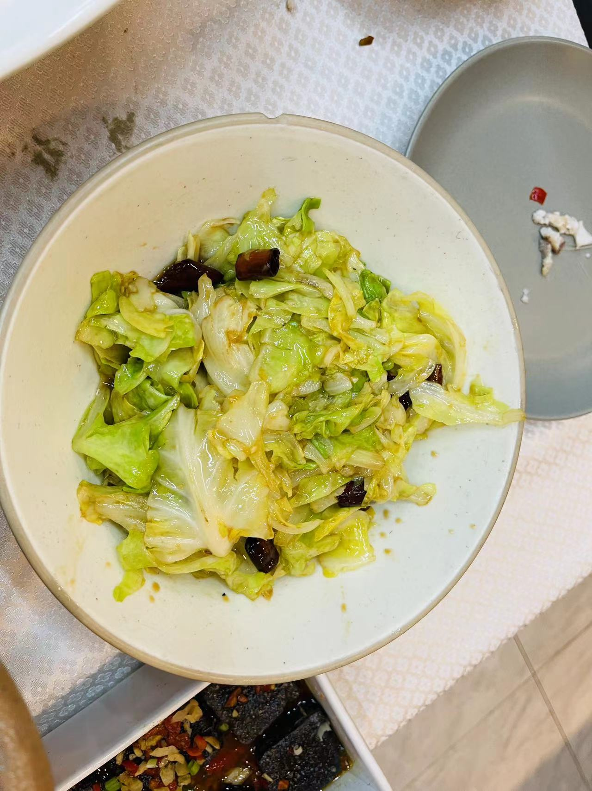
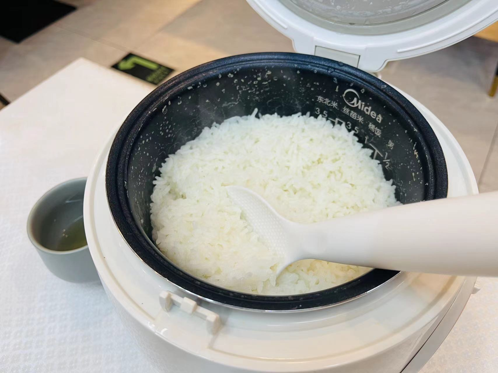

# 湘中缘湖南菜

<!--more-->

店面并不难找,后面跟着早餐俩字不明白啥意思 :joy:  

## 记录
| 时间                   | 地址                            | 人数 | 排队等待 | 花销 |
| ---------------------- | ------------------------------- | ---- | -------- | ---- |
| 2023年08月05日18:40:00 | 朝阳区秋实街北苑家园莲葩园7号1层13号 | 2    | 不用排队 | 188  |

## 一句话
再有饿又累的时候，皮蛋擂辣椒真的可以配一锅米饭

## 点餐
### 凉菜

擂辣椒皮蛋：这个不咋好看的凉菜已经成了我们去湘菜馆子必点的凉菜，自从在某一家吃到这个凉菜后，就变成了湘菜必备  
这个辣椒皮蛋中辣椒很辣，个人口感不够咸，不过依旧不能撼动它下饭神菜的称号

### 热菜

臭豆腐：这个臭豆腐不算太臭，豆腐表皮很脆，汤汁不错

辣椒炒土猪肉：辣椒炒肉不得不说湘菜的辣椒是真的辣，不过肉是带肉皮的感觉，吃起来会感觉有点腻

剁椒鱼头：鱼肉很嫩，有点辣，越吃越上头，停下来就很辣，需要不停地吃，不停地吃...  
这鱼的鱼刺是真的多，后面配的面配这个鱼头汤还真好吃，停不下来，越辣，越爽，吃的越多

清炒时蔬：清炒还是炝炒？口感鲜甜辣，味道不错

### 主食

米饭：米饭很香，看到上来电饭锅就感觉很亲切，感觉回家啦~

## 总结
湘菜香辣，有很独特的味道，可能是因为太饿了，会感觉味道都还挺好吃的~ 湘中缘应该还会再去的

## 附录
[北京吃喝篇](/life-in-beijing/#吃喝篇)

---

> 作者: utopiacraft  
> URL: https://example.com/xiangzhongyuan/  

