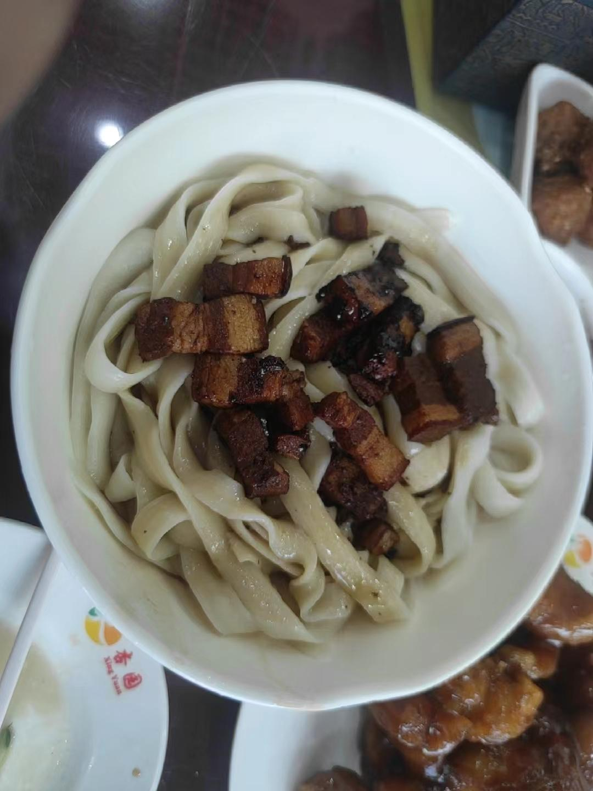
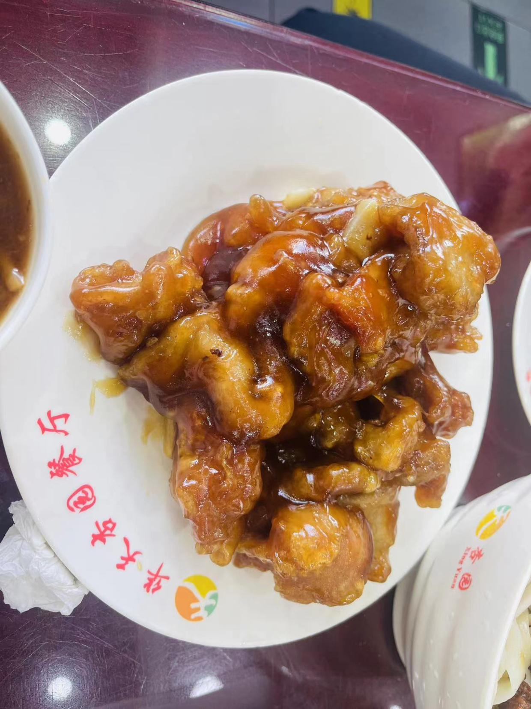
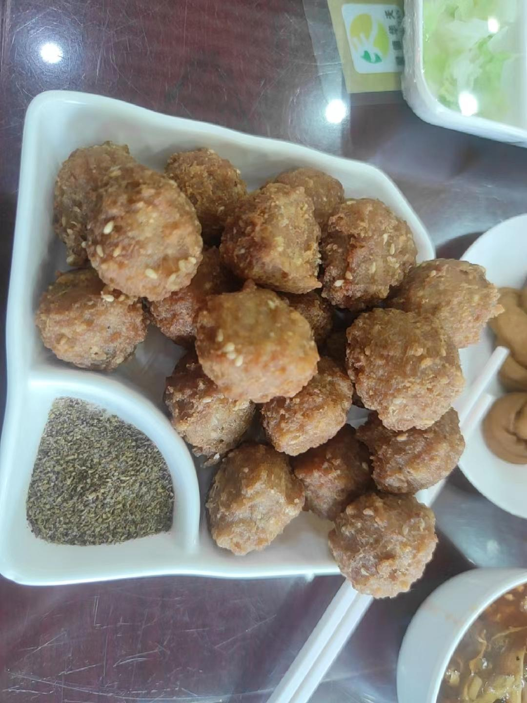
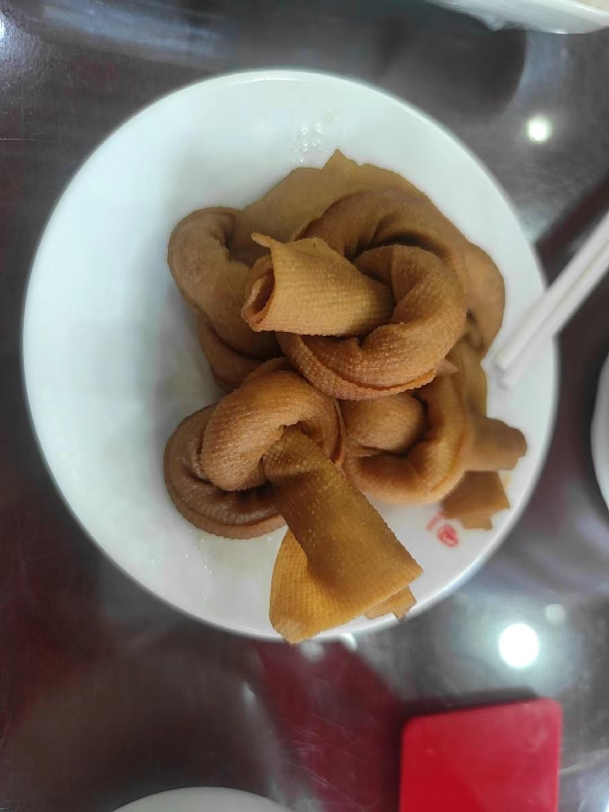

# 杏园餐厅

<!--more-->

## 记录
| 时间                   | 地址                       | 人数 | 排队等待 | 花销 |
| ---------------------- | -------------------------- | ---- | -------- | ---- |
| 2023年05月21日12:45:00 | 北京市西城区西四北大街24号 | 2    | 5分钟    | 170  |

## 一句话
点多了，下次尝尝过油肉
## 点餐

### 主食

炖肉面：吸溜...吸溜... 肥肉也挺香的肥而不腻

双拼捞面：一半过油肉，一半虾仁

### 热菜

糖醋里脊：酸甜口，酸酸甜甜

### 小吃

干炸丸子：本人还是比较喜欢吃丸子的，各种丸子都很好吃

豆皮：豆皮配面条，一样的爽口

## 总结
一家家常小店，很实惠的，据说还是一家国营店，人一直很多，我想哪一天如果路过了，还是会再进去的

## 附录
[北京吃喝篇](/life-in-beijing/#吃喝篇)

---

> 作者: utopiacraft  
> URL: https://example.com/xingyuancanting/  

