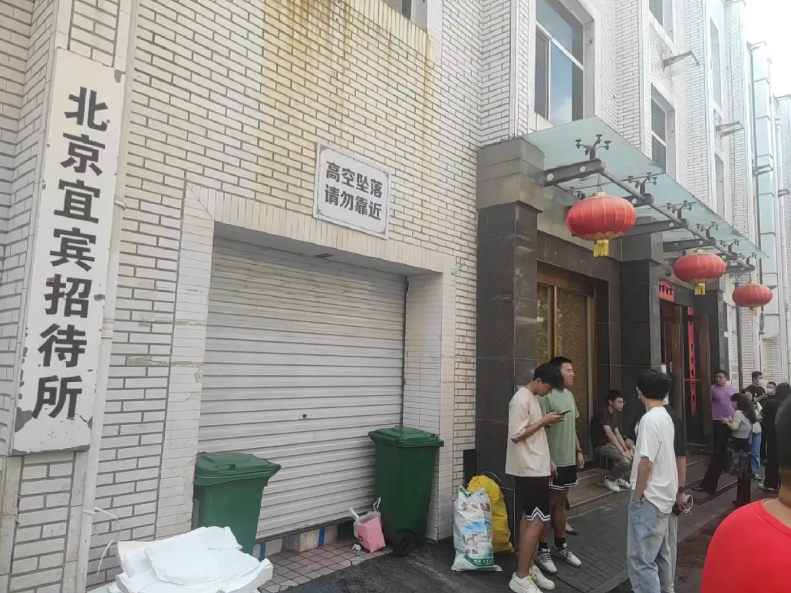
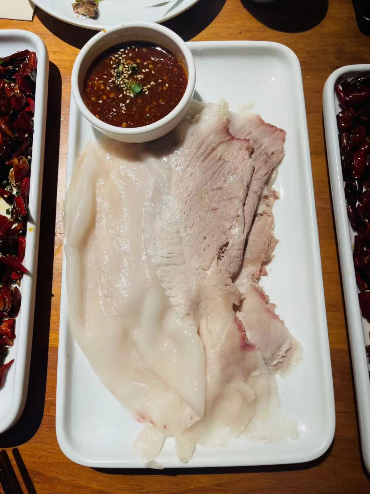
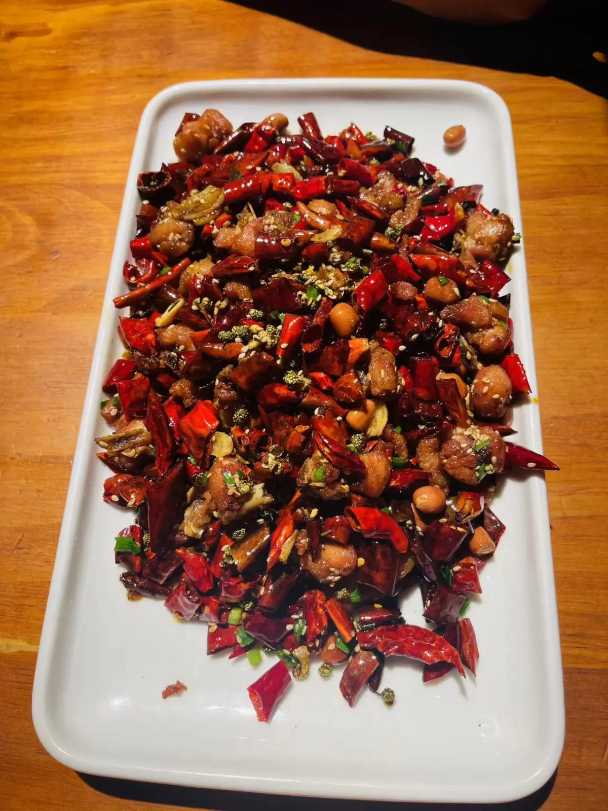
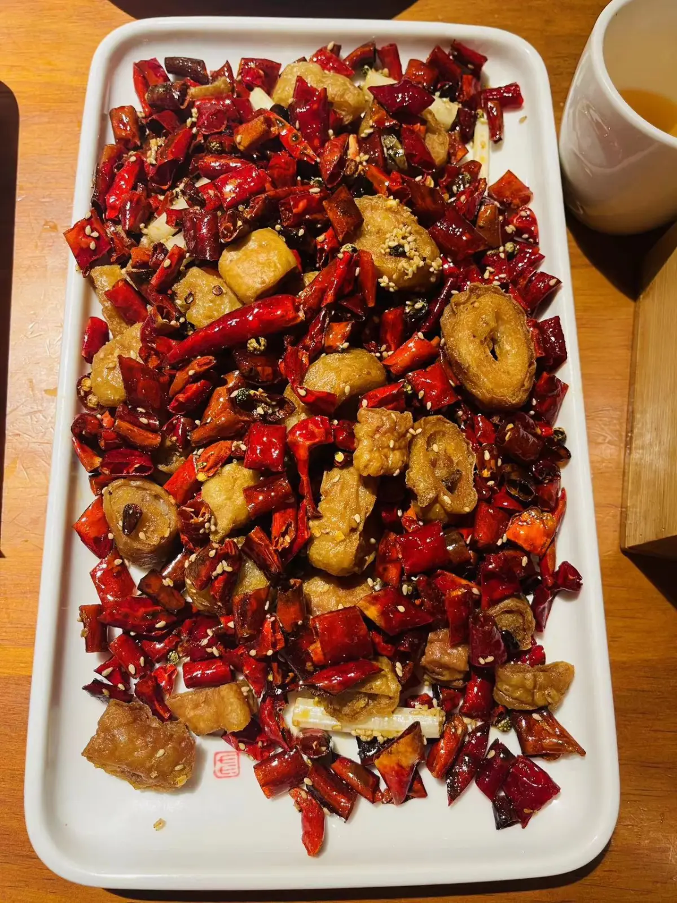
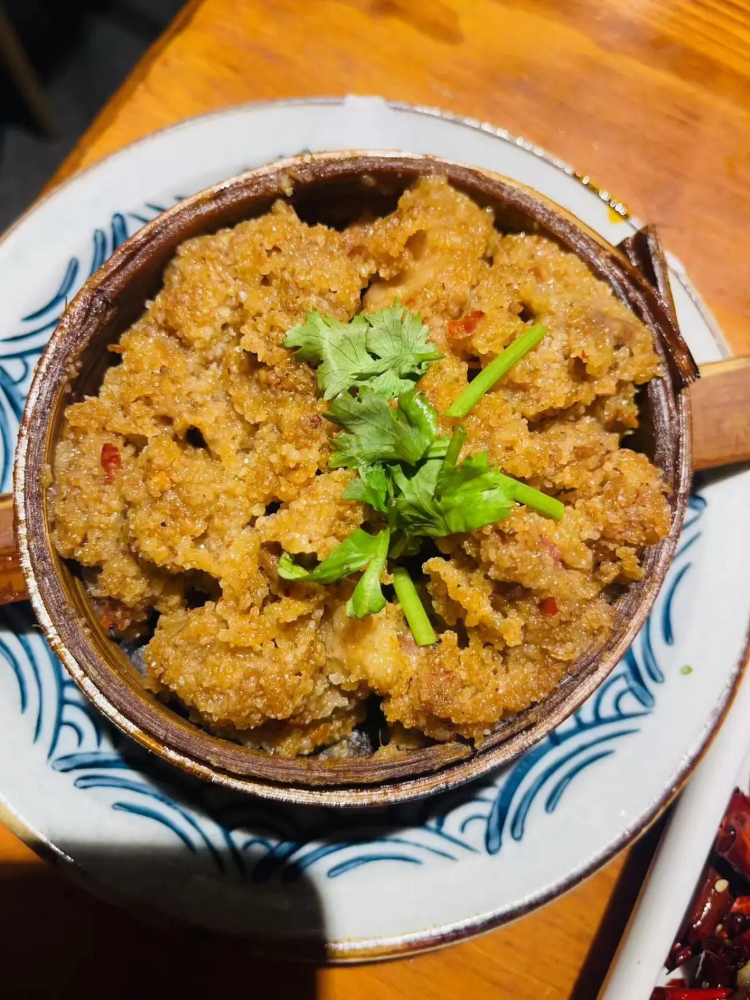
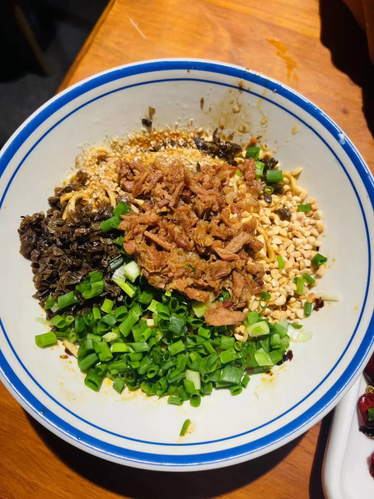
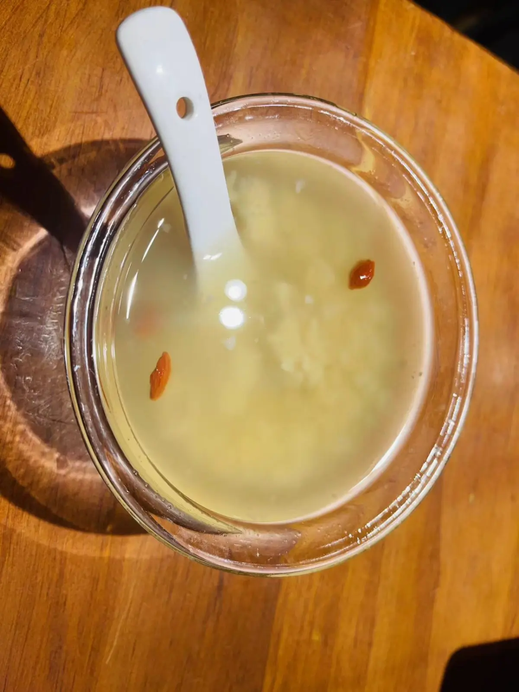
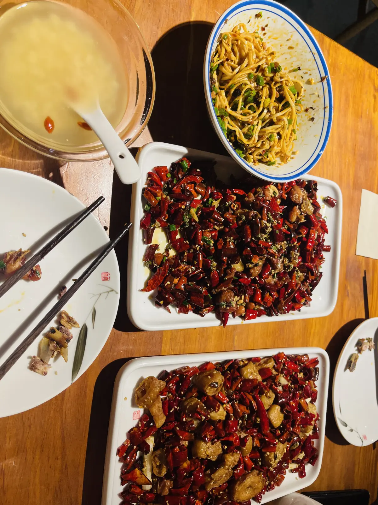

# 宜宾招待所

<!--more-->

门脸不咋地，不过进去之后别有洞天

## 记录

| 时间                   | 地址                     | 人数 | 排队等待                      | 花销 |
| ---------------------- | ------------------------ | ---- | ----------------------------- | ---- |
| 2023年08月26日12:51:00 | 北京市西城区西中胡同28号 | 2    | 3个小时+， 排队不过号，可拼桌 | 275  |

## 一句话
点菜没做好攻略，导致吃起来感觉太腻，不过第一口还是很惊艳的  

## 点餐
### 凉菜

李庄白肉：调制的辣酱很好吃，还特意打包带回去了，肉因人而异，我觉得腻，对面美丽的女士并不觉得

### 热菜

川香辣子鸡：第一口真的好香，还有点烫嘴，花生米没有那么脆

酒都肥肠：肥肠是酥脆的，没有脏器味道，不过和辣子鸡实在太同类的，导致没有感觉到特别惊艳

粉蒸牛肉：牛肉是嫩的，吃起来很软糯，很久没有吃到这么嫩的牛肉了，也因人而异，对面美丽的女士并不太喜欢

### 主食

宜宾燃面：看不到辣椒，不过依然感觉很辣，不糊嘴，很好吃  

### 甜品

醉三江：不甜，要是按照米酒的方式去喝，就没有那种意思

## 总结
这次点餐比较失败，没有蔬菜，吃起来就会感觉很腻，2个人其实没有吃完，下次去的话，会尝尝毛血旺，不过人是真的多...

## 附录
[北京吃喝篇](/life-in-beijing/#吃喝篇)

---

> 作者: utopiacraft  
> URL: https://example.com/yibinzhaodaisuo/  

